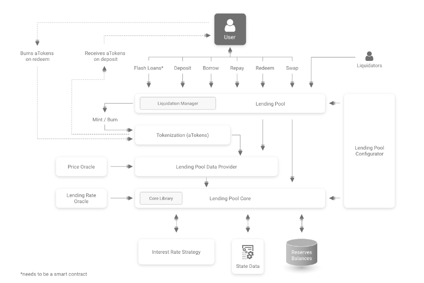

# Aave V1 Protocol Architecture

Aave V1 is a pool-based lending protocol.

Users do not lend directly to other users. Instead, lenders deposit assets into shared reserves, and borrowers borrow from those reserves by providing collateral.

The protocol is composed of multiple smart contracts. Each contract has a specific responsibility. The goal of this architecture is to separate user actions, protocol state, configuration, tokenization, data aggregation, and interest rate calculation.

This document explains the high-level role of each contract before diving deeper into their implementation.



_Source: Aave Protocol Whitepaper v1.0_

## High-Level Architecture

At a high level, the protocol can be divided into four main areas:

1. User-facing contracts
2. Core accounting and reserve state
3. Configuration and administration
4. Supporting contracts and libraries

The most important thing to understand is that users do not interact directly with every contract.

Most user actions go through `LendingPool`.

`LendingPool` then coordinates with the other contracts.

## User-Facing Layer

### LendingPool

`LendingPool` is the main entry point for users.

Users interact with this contract when they want to perform protocol actions such as:

* deposit
* redeem
* borrow
* repay
* swap borrow rate
* liquidation
* flash loan

For example, when a user deposits DAI, they call:

```solidity
deposit(address reserve, uint256 amount, uint16 referralCode)
```

on the `LendingPool`.

The `LendingPool` does not hold all the protocol state itself. Instead, it coordinates the action by calling other contracts.

For a deposit, the flow is:

```text
User
  |
  | deposit()
  v
LendingPool
  |
  | update reserve state
  v
LendingPoolCore
  |
  | mint aTokens
  v
AToken
  |
  | transfer underlying asset
  v
LendingPoolCore
```

So `LendingPool` is user-facing, but it is not the place where all the funds and reserve data are stored.

## Core State Layer

### LendingPoolCore

`LendingPoolCore` is the core accounting contract of the protocol.

It holds:

* reserve data
* user reserve data
* reserve balances
* deposited assets
* liquidity indexes
* borrow indexes
* interest rate data

This contract is not meant to be the main user-facing contract.

Users normally do not call `LendingPoolCore` directly. Instead, `LendingPool` calls it during protocol actions.

For example, during a deposit:

1. `LendingPool` calls `updateStateOnDeposit()`
2. `LendingPoolCore` updates reserve indexes and interest rates
3. `LendingPoolCore` marks the reserve as collateral for the user if this is the first deposit
4. `LendingPoolCore` receives the underlying asset from the user

## Data Layer

### LendingPoolDataProvider

`LendingPoolDataProvider` is used to aggregate and calculate higher-level data.

It reads data from `LendingPoolCore` and exposes information needed by `LendingPool`.

For example, it can calculate:

* user collateral balance
* user borrow balance
* user liquidity balance
* health factor
* average loan-to-value
* average liquidation threshold

The reason this contract exists is to keep `LendingPoolCore` focused on low-level reserve state, while more complex data calculations are moved to a separate contract.

This separation makes the architecture easier to reason about:

```text
LendingPoolCore = stores state
LendingPoolDataProvider = reads and aggregates state
LendingPool = uses the data to execute user actions
```

In the first simplified version of this project, we may not need the full `LendingPoolDataProvider` yet. It becomes more important when implementing borrowing, collateral checks, health factor, and liquidations.

## Tokenization Layer

### AToken

`AToken` represents a user's deposited position.

When a user deposits an underlying asset into the protocol, they receive the corresponding aToken.

Example:

```text
Deposit 100 DAI
Receive 100 aDAI
```

aTokens are ERC20 tokens.

They represent the user's claim on the underlying reserve.

In Aave V1, aTokens are also interest-bearing. This means the user's aToken balance can grow over time as interest accrues.

The aToken contract keeps track of:

* user principal balance
* user index
* redirected interest balances
* interest redirection addresses

For the first simplified version, the most important behavior is:

```text
deposit underlying asset -> mint aToken
```

So during a deposit:

```solidity
aToken.mintOnDeposit(user, amount);
```

is called by the `LendingPool`.

The `AToken` should only allow the `LendingPool` to mint on deposit.

## Configuration Layer

### LendingPoolConfigurator

`LendingPoolConfigurator` is responsible for protocol configuration.

It is not a normal user-facing contract.

It is used by governance or protocol administrators to configure reserves.

Its responsibilities include:

* initialize a reserve
* configure a reserve
* enable or disable borrowing
* enable or disable stable borrowing
* enable or disable a reserve as collateral
* update reserve parameters
* remove a recently added reserve

For example, before users can deposit DAI, the DAI reserve must be initialized.

A simplified reserve initialization flow is:

```text
Configurator
  |
  | initReserve()
  v
LendingPoolCore
  |
  | stores aToken address
  | stores interest rate strategy
  | initializes indexes
  | marks reserve as active
  v
Reserve ready
```

In our implementation, we may temporarily call `initReserve()` directly on `LendingPoolCore` while building the first version. Later, this should be controlled through `LendingPoolConfigurator`.

## Interest Rate Layer

### InterestRateStrategy

Each reserve has an interest rate strategy.

The interest rate strategy is responsible for calculating:

* liquidity rate
* stable borrow rate
* variable borrow rate

The strategy uses reserve data such as:

* available liquidity
* total stable borrows
* total variable borrows
* average stable borrow rate
* utilization rate

The `LendingPoolCore` calls the interest rate strategy when reserve rates need to be updated.

For example, after a deposit, available liquidity changes.

So the protocol updates the reserve interest rates.

A simplified flow is:

```text
Deposit happens
  |
  v
LendingPoolCore updates reserve state
  |
  v
InterestRateStrategy calculates new rates
  |
  v
LendingPoolCore stores updated rates
```

The interest rate strategy does not hold user funds.

It only calculates rates.

## Oracle Layer

### Price Oracle

The price oracle provides asset prices.

The protocol needs prices to calculate user account data such as:

* collateral value
* borrow value
* health factor
* liquidation conditions

For example, if a user deposits DAI and borrows ETH, the protocol needs to know the value of both assets in a common unit.

The price oracle is especially important for borrowing and liquidations.

### Lending Rate Oracle

The lending rate oracle provides external market rate information.

This can be used by the protocol when calculating or comparing lending and borrowing rates.

In the first simplified version of this project, we can ignore the oracle layer until we implement borrowing, collateral valuation, and liquidations.

## Liquidation Layer

### LiquidationManager

The `LiquidationManager` handles liquidation logic.

A liquidation happens when a borrower's health factor becomes too low.

Liquidators interact with the protocol to repay part of the user's debt and receive part of the collateral in return.

In the architecture diagram, liquidation is connected to `LendingPool`, but the liquidation logic itself is separated into `LiquidationManager`.

This keeps the `LendingPool` from becoming too large.

In the first simplified version, liquidations are out of scope.

## Libraries

### CoreLibrary

`CoreLibrary` contains important reserve and user accounting logic.

It defines structures such as:

```solidity
ReserveData
UserReserveData
```

It also contains logic for:

* updating cumulative indexes
* calculating normalized income
* calculating linear interest
* calculating compounded interest
* calculating user borrow balances

The library is used by `LendingPoolCore`.

This keeps mathematical and accounting logic separated from the main storage contract.

### WadRayMath

`WadRayMath` is used for fixed-point math.

Solidity does not support decimal numbers natively, so Aave uses integer-based fixed-point units:

```text
WAD = 1e18
RAY = 1e27
```

WAD is commonly used for token amounts and ratios with 18 decimals.

RAY is used for higher precision values such as indexes and interest rates.

Examples:

```text
1 ray = 1e27
5% annual rate = 0.05e27 = 5e25
```

The protocol uses ray precision for values like:

* liquidity index
* variable borrow index
* normalized income
* interest rates

## Who Can Call What?

Not every contract is meant to be called by users.

### Usually User-Facing

Users mainly interact with:

```text
LendingPool
AToken
```

`LendingPool` is used for protocol actions.

`AToken` is an ERC20 token, so users can read balances and may transfer aTokens depending on protocol rules.

### Usually Protocol/Internal

These contracts are usually called by other protocol contracts:

```text
LendingPoolCore
LendingPoolDataProvider
InterestRateStrategy
CoreLibrary
WadRayMath
```

`LendingPoolCore` stores important protocol state and should not expose sensitive state-changing functions to random users.

`CoreLibrary` and `WadRayMath` are libraries, so users do not call them directly.

### Usually Admin/Governance

These contracts are controlled by governance or protocol administration:

```text
LendingPoolConfigurator
AddressesProvider
Oracle configuration
```

The configurator can change reserve parameters, so it must be restricted.

## AddressesProvider

The `LendingPoolAddressesProvider` acts as the protocol registry.

It stores the addresses of important protocol contracts, such as:

* LendingPool
* LendingPoolCore
* LendingPoolConfigurator
* LendingPoolDataProvider
* PriceOracle
* LendingRateOracle

Instead of hardcoding addresses everywhere, contracts can read the current address from the provider.

This makes the architecture more flexible.

For example:

```solidity
address core = addressesProvider.getLendingPoolCore();
```

The provider is especially useful because different protocol components need to know where the other components are.

Internally, the provider inherits from `AddressStorage`.

`AddressStorage` contains the generic mapping:

```solidity
mapping(bytes32 => address) private s_addresses;
```

The provider then uses fixed keys like `LENDING_POOL`, `LENDING_POOL_CORE`, and `LENDING_POOL_CONFIGURATOR` to store and read each address.

For example:

```solidity
_setAddress(LENDING_POOL_CORE, coreAddress);
address core = getAddress(LENDING_POOL_CORE);
```

So `AddressStorage` handles the generic key-value storage, while `LendingPoolAddressesProvider` exposes clearer protocol-specific functions such as `setLendingPoolCore()` and `getLendingPoolCore()`.

## Mental Model

A good way to think about the architecture is:

```text
LendingPool = user entry point

LendingPoolCore = protocol state and funds

AToken = tokenized deposit position

LendingPoolConfigurator = admin configuration

LendingPoolDataProvider = high-level data calculations

InterestRateStrategy = interest rate calculation

Oracles = external price and rate data

CoreLibrary = reserve and user accounting logic

WadRayMath = fixed-point math
```

This separation is what makes the protocol modular.

Each contract has a specific role, and the system works because these contracts coordinate with each other.
