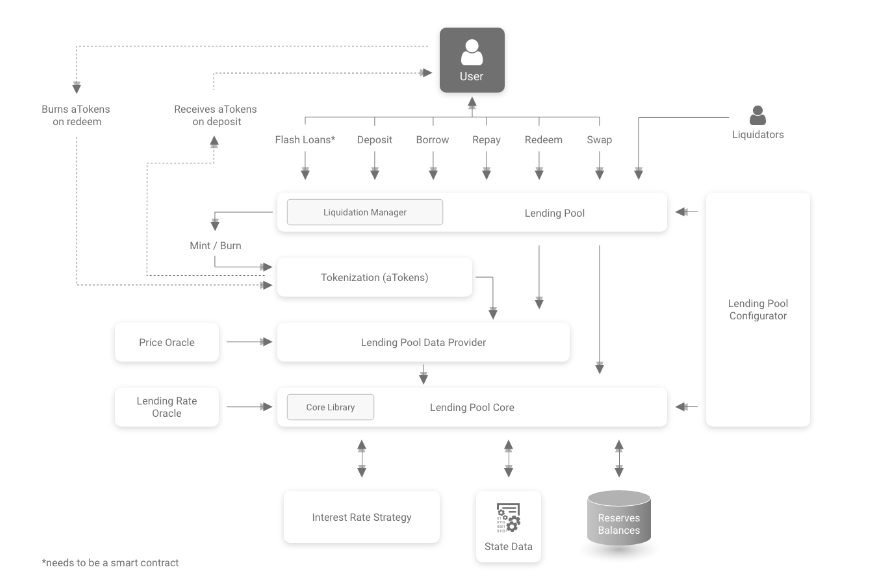

# Aave V1 Protocol Architecture

Aave V1 is a pool-based lending protocol built from contracts with narrowly
defined responsibilities. Users enter through a small public surface, while
separate components maintain reserve accounting, evaluate risk, configure
markets, calculate rates, and distribute protocol fees.

This page is a high-level catalog of the contracts in this educational rebuild.
It explains what each component is responsible for and how the components fit
together. Detailed transaction flows are covered by the operation-specific
pages elsewhere in this documentation.

_Source: Aave Protocol Whitepaper v1.0. The diagram provides historical
context; the catalog below describes the contracts implemented in this
repository._

## Main Protocol Contracts

### `LendingPool`

[`LendingPool`](../src/lendingpool/LendingPool.sol) is the main entry point for
protocol users. It exposes the lending operations, performs action-level
validation, and coordinates the contracts that own accounting and risk data.

The pool relies primarily on `LendingPoolCore` for reserve and user state,
`LendingPoolDataProvider` for account-level risk calculations, and the
Addresses Provider for the other active protocol components. It orchestrates
fund movement but does not hold reserve liquidity itself.

### `LendingPoolCore`

[`LendingPoolCore`](../src/lendingpool/LendingPoolCore.sol) is the protocol's
accounting and custody component. It holds the underlying assets available to
the reserves and stores reserve-level and user-level state, including debt,
collateral usage, indexes, rates, and market configuration.

The core applies accounting transitions requested by authorized protocol
contracts, moves assets into and out of reserves, and asks each reserve's
interest-rate strategy to refresh its rates. Higher-level policy checks remain
in components such as `LendingPool` and `LendingPoolDataProvider`.

### `LendingPoolDataProvider`

[`LendingPoolDataProvider`](../src/lendingpool/LendingPoolDataProvider.sol)
turns low-level Core data into reserve and account-level views. It combines
positions across reserves, values them through the Price Oracle, and derives
risk information such as borrowing capacity, weighted collateral parameters,
and health factor.

`LendingPool`, `AToken`, and `LendingPoolLiquidationManager` use these
calculations when an action could change the safety of a user's position. The
contract reads and calculates data; it does not custody liquidity.

### `AToken`

[`AToken`](../src/tokenization/AToken.sol) is the interest-bearing ERC-20 token
associated with a reserve. It represents a supplier's claim on that reserve's
underlying liquidity and uses the Core's normalized income to expose accrued
interest in token balances.

The pool controls protocol-specific minting, burning, and liquidation hooks.
Normal token movements also consult protocol risk data so that transferring a
collateral position cannot leave an account below the required safety level.
The underlying reserve asset remains in `LendingPoolCore`, not in the aToken.

### `LendingPoolLiquidationManager`

[`LendingPoolLiquidationManager`](../src/lendingpool/LendingPoolLiquidationManager.sol)
contains the specialized logic for resolving undercollateralized positions.
It determines how much debt may be covered and how much collateral may be
claimed, then coordinates the required Core and aToken accounting.

`LendingPool` reaches this component through the manager address registered in
the Addresses Provider and executes its liquidation logic by `delegatecall`.
Separating this logic keeps the pool's main user-facing contract smaller while
preserving a single external entry point.

## Configuration and Registry Contracts

### `LendingPoolAddressesProvider`

[`LendingPoolAddressesProvider`](../src/configuration/LendingPoolAddressesProvider.sol)
is the central registry for active protocol components. It records addresses
for the pool, Core, data provider, configurator, liquidation manager, parameter
and fee providers, oracles, token distributor, and lending-pool manager.

Protocol contracts use this registry instead of hard-coding every collaborator.
The registry owner controls its entries, while the registered lending-pool
manager is a separate administrative role used by the configurator. The
lending-pool manager is an address-based role in this repository, not a
dedicated implemented contract.

### `AddressStorage`

[`AddressStorage`](../src/configuration/AddressStorage.sol) is the small storage
base inherited by the Addresses Provider. It supplies the generic keyed mapping
used to register and retrieve component addresses. It is an implementation
building block rather than a user-facing protocol service.

### `LendingPoolConfigurator`

[`LendingPoolConfigurator`](../src/lendingpool/LendingPoolConfigurator.sol) is
the administrative gateway for reserve management. It initializes supported
markets and their aTokens and controls reserve activation, freezing, borrowing
modes, collateral parameters, decimals, and interest-rate strategies.

Only the lending-pool manager registered in the Addresses Provider may invoke
its configuration operations. The configurator delegates the resulting state
changes to `LendingPoolCore`, whose configuration methods accept calls only
from the registered configurator.

### `LendingPoolParametersProvider`

[`LendingPoolParametersProvider`](../src/configuration/LendingPoolParametersProvider.sol)
exposes protocol-wide operational parameters used by `LendingPool` and the
liquidation logic. In this implementation those parameters cover stable-borrow
limits, stable-rate rebalancing, and flash-loan fee settings.

Unlike reserve-specific risk configuration, these values apply to pool behavior
across markets. The current contract exposes fixed constants rather than
mutable governance settings.

## Rates and Price Contracts

### `DefaultReserveInterestRateStrategy`

[`DefaultReserveInterestRateStrategy`](../src/lendingpool/DefaultReserveInterestRateStrategy.sol)
is the default per-reserve interest-rate model. It derives the liquidity,
stable-borrow, and variable-borrow rates from available liquidity, outstanding
debt, utilization, and configured rate-curve parameters.

`LendingPoolCore` invokes the strategy when reserve conditions change and
stores the resulting rates. The strategy reads the Lending Rate Oracle for the
market rate used as the stable-rate baseline; it calculates rates but holds no
funds or user positions.

### Price Oracle

The Price Oracle supplies asset prices in a common reference unit. The
`LendingPoolDataProvider` and liquidation logic use those prices to compare
collateral, debt, and fees across different reserve assets.

This repository defines the oracle boundary through
[`IPriceOracleGetter`](../src/interfaces/IPriceOracleGetter.sol) and
[`IPriceOracle`](../src/interfaces/IPriceOracle.sol). The active oracle address
is registered in the Addresses Provider; a concrete production oracle is an
external dependency rather than an implementation in `src`.

### Lending Rate Oracle

The Lending Rate Oracle supplies an asset-specific market borrowing rate used
as the baseline for stable borrowing. Interest-rate strategies and the Core
read it through
[`ILendingRateOracle`](../src/interfaces/ILendingRateOracle.sol), and the
Addresses Provider selects the active implementation.

As with the Price Oracle, this repository defines the integration interface but
does not provide a concrete oracle implementation.

## Fees and Distribution Contracts

### `FeeProvider`

[`FeeProvider`](../src/fees/FeeProvider.sol) calculates the protocol-wide loan
origination fee. `LendingPool` and `LendingPoolDataProvider` use it when
validating and recording borrowed positions.

The provider is a calculator only: it neither custodies fees nor distributes
them. Its address is resolved through the Addresses Provider.

### `TokenDistributor`

[`TokenDistributor`](../src/fees/TokenDistributor.sol) is the destination and
distribution mechanism for protocol fees. It can hold ERC-20 assets and native
ETH and split them among the recipients configured at deployment.

Protocol components obtain its address from the Addresses Provider when
routing origination and flash-loan protocol fees. Distribution may be
triggered permissionlessly, but callers cannot change the configured
recipients or their shares.

## Flash-Loan Integration Contracts

### `IFlashLoanReceiver`

[`IFlashLoanReceiver`](../src/flashloan/interfaces/IFlashLoanReceiver.sol)
defines the callback that a flash-loan receiver must implement. `LendingPool`
uses this boundary to hand control to the receiver during a flash loan and then
verifies that the reserve has been repaid before completing the transaction.

Receiver contracts are integrations supplied by protocol users or developers;
they are not trusted accounting components of the lending pool.

### `FlashLoanReceiverBase`

[`FlashLoanReceiverBase`](../src/flashloan/base/FlashLoanReceiverBase.sol) is an
optional abstract base for building receiver contracts. It implements shared
helpers for identifying the current Core, reading balances, and returning
ERC-20 assets or native ETH to the pool.

The base is developer-facing support code. A concrete receiver must still
implement its own callback behavior through `IFlashLoanReceiver`.

## Libraries and Interfaces

### `CoreLibrary`

[`CoreLibrary`](../src/libraries/CoreLibrary.sol) defines the reserve and user
data structures used by `LendingPoolCore` and contains the accounting routines
that operate on them. Its responsibilities include interest accrual, normalized
balances, debt calculations, indexes, and reserve configuration flags.

Keeping this logic in a library separates the accounting model from the Core
contract that owns the corresponding storage and assets.

### `WadRayMath`

[`WadRayMath`](../src/libraries/WadRayMath.sol) provides the fixed-point
arithmetic used throughout the protocol. Wad precision is used for token-scale
values, while ray precision supports high-precision rates and cumulative
indexes.

### `EthAddressLib`

[`EthAddressLib`](../src/libraries/EthAddressLib.sol) defines the sentinel
address used to represent native ETH wherever the same protocol path must also
support ERC-20 reserve addresses.

### Protocol interfaces

The interfaces under [`src/interfaces`](../src/interfaces/) define the
boundaries between replaceable or externally supplied components, including
the Addresses Provider, fee provider, oracles, liquidation manager, and
interest-rate strategies. They describe how contracts collaborate without
requiring callers to depend on concrete implementations.

## Interaction and Access Summary

| Category | Components | Role |
| --- | --- | --- |
| User-facing | `LendingPool`, `AToken` | Expose lending actions and tokenized supplier positions. |
| Accounting and risk | `LendingPoolCore`, `LendingPoolDataProvider`, `LendingPoolLiquidationManager` | Hold funds and state, derive account safety, and resolve unhealthy positions. |
| Administrative | `LendingPoolAddressesProvider`, `LendingPoolConfigurator`, lending-pool manager role | Register components and control reserve configuration. |
| Economic services | `LendingPoolParametersProvider`, `DefaultReserveInterestRateStrategy`, oracles, `FeeProvider`, `TokenDistributor` | Supply parameters, rates, prices, fee calculations, and fee distribution. |
| Integration-facing | `IFlashLoanReceiver`, `FlashLoanReceiverBase` | Define and support external flash-loan receivers. |
| Internal building blocks | `AddressStorage`, `CoreLibrary`, `WadRayMath`, `EthAddressLib`, protocol interfaces | Provide storage, accounting, math, asset representation, and contract boundaries. |

The central relationship is that `LendingPool` coordinates user actions,
`LendingPoolCore` owns reserve state and liquidity, and the remaining contracts
supply the risk, configuration, pricing, rate, fee, and integration services
needed to operate the protocol safely.
