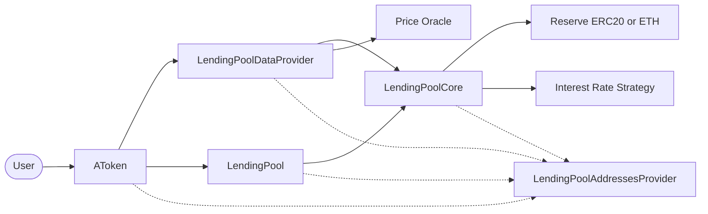

# Redeem

The `redeem` feature is the user entry point for exchanging aTokens for the
underlying reserve asset.

In this implementation, the user starts the operation on the reserve's aToken.
The aToken validates and burns the requested balance, while `LendingPool`
coordinates the reserve update and asks `LendingPoolCore` to return the
underlying asset.

This document is a rebuild map. It lists the contracts involved and the
functions that must exist for `AToken.redeem()` to work.

## Redeem Goal

```text
User burns aDAI
LendingPoolCore sends DAI
User receives the redeemed DAI
```

For a normal redemption, the aToken amount and underlying amount are 1:1:

```text
redeem amount = 40 aDAI
underlying returned = 40 DAI
```

The user's visible aToken balance may include interest that has accrued since
their last balance update. `AToken.redeem()` first materializes that interest,
then burns the requested amount.

Passing `type(uint256).max` requests a full redemption of the user's current
balance, including accrued interest.

## High-Level Flow

Unlike a deposit, redeem does not require an ERC20 approval. The underlying
asset is already held by `LendingPoolCore`.

```text
User
  |
  | redeem(amount)
  v
AToken
  |
  | materializes interest
  | validates collateral safety
  | burns aTokens
  | redeemUnderlying(reserve, user, amount, remainingBalance)
  v
LendingPool
  |
  | checks reserve state and available liquidity
  | updates reserve accounting
  | transfers underlying from the core
  v
LendingPoolCore
```

The important balance changes are:

```text
user aToken balance decreases by amount
core underlying balance decreases by amount
user underlying balance increases by amount
reserve available liquidity decreases by amount
```

Every step runs in one transaction. If the safety check, liquidity check, state
update, or underlying transfer reverts, the earlier interest mint and aToken
burn are also reverted.

## Contract Interaction Diagram



## Contracts Involved

### `AToken`

The aToken is the user-facing entry point for redemption.

It materializes accrued interest, supports full-balance redemption, checks that
the balance decrease does not make the user's borrowing position unsafe, burns
the aTokens, clears zero-balance user data, and calls the lending pool.

Required functions:

- `constructor(address _addressesProvider, address _underlyingAsset, uint8 _underlyingAssetDecimals, string memory _name, string memory _symbol)`
- `redeem(uint256 _amount)`
- `isTransferAllowed(address _user, uint256 _amount)`
- `balanceOf(address _user)`
- `_cumulateBalance(address _user)`
- `_calculateCumulatedBalance(address _user, uint256 _balance)`
- `_updateRedirectedBalanceOfRedirectionAddress(address _user, uint256 _balanceToAdd, uint256 _balanceToRemove)`
- `_resetDataOnZeroBalance(address _user)`

External functions called by `redeem()`:

- `LendingPoolDataProvider.balanceDecreaseAllowed(underlyingAsset, user, amount)`
- `LendingPool.redeemUnderlying(underlyingAsset, user, amount, balanceAfterRedeem)`

The constructor resolves and stores the registered pool, core, and data
provider. All three addresses, as well as the addresses provider and underlying
asset, must be nonzero.

Important validations:

- `_amount` must be greater than zero.
- `_amount` cannot exceed the current balance after accrued interest is
  materialized.
- `type(uint256).max` means redeem the full current balance.
- `isTransferAllowed()` must return `true`.

If the remaining principal balance is zero, `_resetDataOnZeroBalance()` clears
the user's interest-redirection target. It also clears the user's liquidity
index when nobody redirects interest to that user. A redirected balance keeps
the index alive because that balance can continue to accrue interest.

### `LendingPoolDataProvider`

Protects borrowing positions when an aToken balance is reduced. The same check
can be reused by redemption and aToken transfers because both remove balance
that may be serving as collateral.

Required functions:

- `constructor(address _addressProvider)`
- `balanceDecreaseAllowed(address _reserve, address _user, uint256 _amount)`
- `calculateUserGlobalData(address _user)`
- `_calculateHealthFactorFromBalances(uint256 collateralBalanceETH, uint256 borrowBalanceETH, uint256 totalFeesETH, uint256 liquidationThreshold)`

The constructor requires a nonzero addresses provider and a registered
`LendingPoolCore`. It stores the core address and uses the addresses provider to
resolve the price oracle when account values must be converted to ETH.

`balanceDecreaseAllowed()` returns early with `true` when:

- the reserve is not globally enabled as collateral;
- the user is not using that reserve as collateral; or
- the user has no outstanding borrow.

The first two cases return before global account data is calculated. The
no-borrow case is discovered from `calculateUserGlobalData()`, so that path can
still read oracle prices for the user's active reserves before returning
`true`.

Otherwise it simulates the balance decrease:

1. Read the user's balances and collateral configuration across all reserves.
2. Convert the amount being removed to ETH using the price oracle.
3. Subtract that value from the user's total collateral.
4. Recalculate the weighted liquidation threshold without that collateral.
5. Recalculate the health factor.
6. Allow the decrease only when the new health factor is strictly greater than
   `1e18`.

The health-factor formula is:

```text
adjusted collateral = collateralBalanceETH * liquidationThreshold / 100

health factor = adjusted collateral / (borrowBalanceETH + totalFeesETH)
```

`WadRayMath.wadDiv()` expresses the result in wad units, where `1e18` is 1.0.
If the user has no borrow, the health factor is `type(uint256).max`.

`calculateUserGlobalData()` loops over `core.getReserves()` and aggregates:

- supplied liquidity in ETH;
- collateral in ETH;
- borrows in ETH;
- origination fees in ETH;
- weighted average loan-to-value;
- weighted average liquidation threshold; and
- the current health factor.

### `LendingPool`

Coordinates the protocol side of the redemption. Users do not call
`redeemUnderlying()` directly; only the aToken registered for `_reserve` may
call it.

Required functions and modifiers:

- `constructor(address _addressesProvider)`
- `redeemUnderlying(address _reserve, address payable _user, uint256 _amount, uint256 _aTokenBalanceAfterRedeem)`
- `onlyOverlyingAToken(address _reserve)`
- `onlyActiveReserve(address _reserve)`
- `onlyAmountGreaterThanZero(uint256 _amount)`

External functions called by `redeemUnderlying()`:

- `LendingPoolCore.getReserveATokenAddress(_reserve)`
- `LendingPoolCore.getReserveIsActive(_reserve)`
- `LendingPoolCore.getReserveAvailableLiquidity(_reserve)`
- `LendingPoolCore.updateStateOnRedeem(_reserve, _user, _amount, userRedeemedEverything)`
- `LendingPoolCore.transferToUser(_reserve, _user, _amount)`

Important validations:

- the caller must be the reserve's registered aToken;
- the reserve must be active;
- the amount must be greater than zero;
- available reserve liquidity must be at least the requested amount; and
- the call must not be reentrant.

A frozen reserve is not rejected during redemption. Freezing blocks new
deposits, but users must still be able to exit an active reserve.

### `LendingPoolCore`

Stores reserve state and custody of the underlying assets.

For redeem, it updates cumulative indexes and interest rates, optionally
disables the user's collateral flag, and transfers the underlying asset to the
user.

Required state-changing functions:

- `updateStateOnRedeem(address _reserve, address _user, uint256 _amountRedeemed, bool _userRedeemedEverything)`
- `transferToUser(address _reserve, address payable _user, uint256 _amount)`
- `setUserUseReserveAsCollateral(address _reserve, address _user, bool _useAsCollateral)`
- `_updateReserveInterestRatesAndTimestamp(address _reserve, uint256 _liquidityAdded, uint256 _liquidityTaken)`

Required view functions:

- `getReserveATokenAddress(address _reserve)`
- `getReserveAvailableLiquidity(address _reserve)`
- `getReserveNormalizedIncome(address _reserve)`
- `getReserveConfiguration(address _reserve)`
- `isUserUseReserveAsCollateralEnabled(address _reserve, address _user)`
- `getReserves()`
- `getUserBasicReserveData(address _reserve, address _user)`
- `getUserUnderlyingAssetBalance(address _reserve, address _user)`

`updateStateOnRedeem()` performs three accounting operations:

- updates cumulative liquidity and variable-borrow indexes using the old rates;
- calculates and stores the new rates using liquidity after the redemption; and
- disables the user's collateral flag when the remaining aToken balance is
  zero.

The full-redemption flag comes from the remaining aToken balance, not from the
requested input. This means `type(uint256).max` and an explicit full-balance
amount behave identically.

Important permissions:

- `onlyLendingPool()` protects `updateStateOnRedeem()`, `transferToUser()`, and
  `setUserUseReserveAsCollateral()`.

For an ERC20 reserve, `transferToUser()` uses `safeTransfer(user, amount)`. For
the native ETH reserve, it sends ETH with a low-level call and reverts if the
transfer fails.

### `LendingPoolAddressesProvider`

Registry used to connect the redeem components and locate the oracle.

Redeem adds the data provider and price oracle to the addresses needed by the
deposit setup.

Required functions:

- `setLendingPoolDataProvider(address _provider)`
- `getLendingPoolDataProvider()`
- `setPriceOracle(address _priceOracle)`
- `getPriceOracle()`
- `setLendingPool(address _pool)`
- `getLendingPool()`
- `setLendingPoolCore(address _lendingPoolCore)`
- `getLendingPoolCore()`
- `setLendingPoolConfigurator(address _configurator)`
- `getLendingPoolConfigurator()`

The setter functions are owner-only and reject the zero address.

### Price Oracle

The price oracle converts reserve token balances to a common ETH-denominated
value so collateral and debt from different reserves can be compared.

Required interface:

- `IPriceOracleGetter.getAssetPrice(address _asset)`

The returned price is the ETH value of one whole reserve token. The data
provider accounts for token decimals when converting an amount:

```text
amountInETH = assetPriceInETH * tokenAmount / 10 ** reserveDecimals
```

The oracle is needed when global user data is calculated for a collateralized
position. The current unit tests use `MockPriceOracle`.

### Reserve Asset

The reserve is the underlying asset returned to the user, such as DAI or native
ETH.

Required ERC20 function:

- `transfer(address to, uint256 amount)`
- `balanceOf(address account)`

OpenZeppelin's `SafeERC20.safeTransfer()` wraps the ERC20 transfer. Native ETH
is identified by `EthAddressLib.ethAddress()` and does not use the ERC20
interface.

### Interest Rate Strategy

`LendingPoolCore` recalculates reserve rates when liquidity leaves the reserve.

Required interface functions:

- `calculateInterestRates(address _reserve, uint256 _utilizationrate, uint256 _totalBorrowsStable, uint256 _totalBorrowsVariable, uint256 _averageStableBorrowRate)`
- `getBaseVariableBorrowRate()`

For a redemption, the strategy receives available liquidity after subtracting
the redeemed amount, even though the underlying transfer happens immediately
after the accounting update.

## Libraries Involved

### `CoreLibrary`

Defines reserve and user accounting structs and performs the index calculations
used by `LendingPoolCore`.

Required items include:

- `ReserveData`
- `UserReserveData`
- `updateCumulativeIndexes(ReserveData storage _self)`
- `getNormalizedIncome(ReserveData storage _reserve)`
- `getCompoundedBorrowBalance(UserReserveData storage _self, ReserveData storage _reserve)`
- `calculateLinearInterest(uint256 _rate, uint40 _lastUpdateTimestamp)`
- `calculateCompoundedInterest(uint256 _rate, uint40 _lastUpdateTimestamp)`

### `WadRayMath`

Used by `AToken`, `CoreLibrary`, and `LendingPoolDataProvider` for interest and
health-factor calculations.

Required functions include:

- `wadToRay(uint256)`
- `rayToWad(uint256)`
- `wadDiv(uint256, uint256)`
- `rayMul(uint256, uint256)`
- `rayDiv(uint256, uint256)`
- `rayPow(uint256, uint256)`

### `EthAddressLib`

Used by `LendingPoolCore` to distinguish native ETH reserves from ERC20
reserves.

Required function:

- `ethAddress()`

### OpenZeppelin Dependencies

- `ReentrancyGuard.nonReentrant()` protects `LendingPool.redeemUnderlying()`.
- `ERC20._mint()` materializes accrued aToken interest.
- `ERC20._burn()` removes the redeemed aTokens.
- `SafeERC20.safeTransfer()` returns ERC20 reserves from the core.
- `Ownable.onlyOwner` protects address-provider setters.

## Required Setup Before Redeem

Redeem builds on the deposit setup. The data provider must be registered before
the aToken is deployed because the aToken constructor resolves it immediately.

Minimum setup order:

1. Deploy `LendingPoolAddressesProvider`.
2. Deploy `LendingPoolCore` with the addresses provider.
3. Register the core with `setLendingPoolCore()`.
4. Deploy `LendingPool` with the addresses provider.
5. Register the pool with `setLendingPool()`.
6. Deploy `LendingPoolDataProvider` with the addresses provider.
7. Register the data provider with `setLendingPoolDataProvider()`.
8. Deploy and register a price oracle with `setPriceOracle()` when collateral
   health-factor calculations are in scope.
9. Register the lending pool configurator.
10. Deploy the reserve token and its matching aToken.
11. Deploy or select an interest rate strategy.
12. Initialize the reserve in `LendingPoolCore`.
13. Deposit underlying liquidity so the user owns aTokens and the core has
    assets available to return.
14. Call `aToken.redeem(amount)` as the aToken holder.

The critical registration order is:

```text
register core
    -> deploy pool and data provider
register pool and data provider
    -> deploy aToken
```

An oracle is not consulted when the reserve cannot be used as collateral or the
user has not enabled it as collateral. For a collateral reserve with debt, each
relevant reserve must have a valid oracle price.

## `AToken.redeem()` Execution

The implemented function follows this order.

### 1. Validate the Input

```solidity
if (_amount == 0) {
    revert AToken__AmountIsZero();
}
```

Zero is never a valid redemption request.

### 2. Materialize Accrued Interest

```solidity
(, uint256 currentBalance, uint256 balanceIncrease, uint256 index) =
    _cumulateBalance(msg.sender);
```

`_cumulateBalance()` calculates the user's balance at the current reserve
normalized-income index, mints the accrued difference, and stores the current
index for the user.

### 3. Resolve the Amount

```solidity
uint256 amountToRedeem = _amount;

if (_amount == type(uint256).max) {
    amountToRedeem = currentBalance;
}
```

An explicit amount performs a partial or full redemption. The maximum `uint256`
value is a convenience value meaning "redeem everything."

The resolved amount cannot exceed `currentBalance`.

### 4. Check Collateral Safety

```solidity
if (!isTransferAllowed(msg.sender, amountToRedeem)) {
    revert AToken__TransferNotAllowed();
}
```

`isTransferAllowed()` delegates to
`LendingPoolDataProvider.balanceDecreaseAllowed()`. If the aTokens secure a
borrow, the data provider simulates the user's health factor after removing the
requested collateral.

### 5. Update Interest Redirection

If the user redirects interest to another account, the aToken adds newly
accrued interest and removes the redeemed amount from the balance participating
in that redirection.

### 6. Burn aTokens and Reset Empty User Data

```solidity
_burn(msg.sender, amountToRedeem);
```

When `currentBalance - amountToRedeem` is zero,
`_resetDataOnZeroBalance()` clears the user's redirection target and, when
possible, their liquidity index.

### 7. Ask the Pool to Return Underlying

```solidity
i_pool.redeemUnderlying(
    i_underlyingAssetAddress,
    payable(msg.sender),
    amountToRedeem,
    currentBalance - amountToRedeem
);
```

Passing the remaining balance lets the pool tell the core whether this was a
full redemption.

### 8. Check Pool and Reserve State

Inside `LendingPool.redeemUnderlying()`:

- `onlyOverlyingAToken` authenticates the caller;
- `onlyActiveReserve` checks the reserve is active;
- `onlyAmountGreaterThanZero` checks the resolved amount;
- `nonReentrant` protects the external transfer flow; and
- `getReserveAvailableLiquidity()` ensures the core can return the amount.

### 9. Update Reserve State

```solidity
i_core.updateStateOnRedeem(
    _reserve,
    _user,
    _amount,
    _aTokenBalanceAfterRedeem == 0
);
```

The core updates indexes using the rates that applied since the previous
timestamp, calculates rates for the reduced liquidity, stores the new
timestamp, and disables collateral usage on a full redemption.

### 10. Transfer the Underlying Asset

```solidity
i_core.transferToUser(_reserve, _user, _amount);
```

For ERC20 reserves, the core safely transfers tokens to the user. For native
ETH, the core sends ETH directly and verifies that the call succeeded.

### 11. Emit Events

The pool emits:

```solidity
emit RedeemUnderlying(_reserve, _user, _amount, block.timestamp);
```

After the pool call succeeds, the aToken emits:

```solidity
emit Redeem(
    msg.sender,
    amountToRedeem,
    balanceIncrease,
    userIndexReset ? 0 : index
);
```

## Partial and Full Redemption

Assume the user has `100 aDAI` and the core holds enough DAI.

Partial redemption:

```solidity
aDai.redeem(40 ether);
```

Expected result:

```text
user receives 40 DAI
user keeps 60 aDAI
core keeps 60 DAI from this deposit
user's reserve collateral flag remains enabled
```

Full redemption can use either the exact balance or `type(uint256).max`:

```solidity
aDai.redeem(type(uint256).max);
```

Expected result, ignoring any unrelated reserve activity:

```text
user receives the full current underlying balance
user aDAI balance becomes zero
user's reserve collateral flag is disabled
user redirection data is cleared
user index is cleared when no redirected balance remains
```

## Collateral Safety Example

Assume:

```text
collateral = 100 tokens
asset price = 0.01 ETH
collateral value = 1 ETH
liquidation threshold = 80%
borrow value = 0.5 ETH
fees = 0
```

Redeeming 10 tokens removes `0.1 ETH` of collateral:

```text
collateral after redeem = 0.9 ETH
adjusted collateral = 0.9 ETH * 80% = 0.72 ETH
health factor = 0.72 / 0.5 = 1.44
```

`1.44e18 > 1e18`, so the redemption is allowed.

Redeeming 40 tokens removes `0.4 ETH`:

```text
collateral after redeem = 0.6 ETH
adjusted collateral = 0.6 ETH * 80% = 0.48 ETH
health factor = 0.48 / 0.5 = 0.96
```

`0.96e18` is below the required threshold, so `AToken.redeem()` reverts with
`AToken__TransferNotAllowed`.

## Failure Conditions

The redemption reverts when:

- the requested amount is zero;
- the resolved amount exceeds the user's current aToken balance;
- removing the aTokens would leave a collateralized borrow at or below the
  required health factor;
- `redeemUnderlying()` is called by anything other than the reserve's aToken;
- the reserve is inactive;
- the core has less available liquidity than the amount requested;
- the interest rate or reserve-state update fails;
- the ERC20 transfer fails; or
- the native ETH transfer fails.

Because the transaction is atomic, none of the aToken balance, index,
redirection, collateral, reserve-rate, or underlying balance changes persist
after a revert.

## Integration Test Scenario

`ATokenIntegrationTest.testUserCanDepositAndRedeemUnderlying()` covers the
implemented ERC20 path:

1. Mint `100 DAI` to the user.
2. Approve the core and deposit `100 DAI`.
3. Redeem `40 aDAI` through `AToken.redeem()`.
4. Assert that the user receives `40 DAI`.
5. Assert that the core and user each retain the expected `60` balances.
6. Assert that reserve available liquidity is `60 DAI`.
7. Assert that the user index remains `1 ray`.
8. Assert that a partial redemption keeps the user's collateral flag enabled.

The unit tests separately cover the data-provider health-factor branches, core
rate and collateral updates, ERC20 and ETH transfers, and pool authorization
and reentrancy checks. Direct `AToken.redeem()` validation remains an area for
additional unit coverage.
