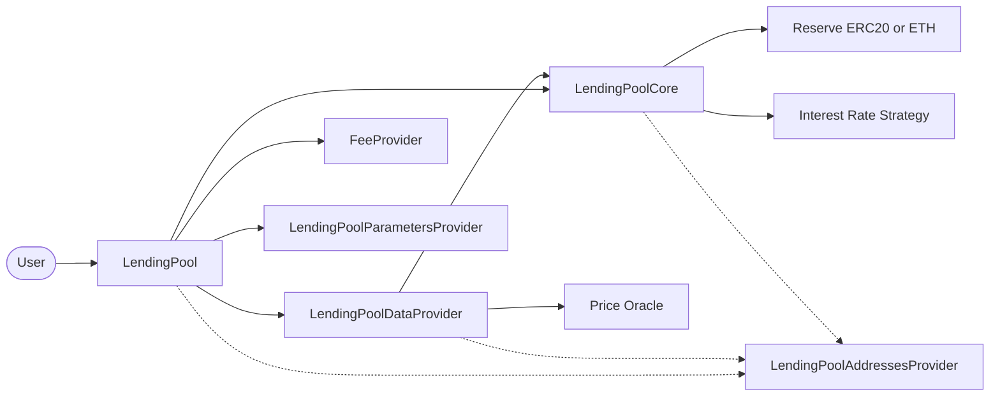

# Borrow

The `borrow` feature lets a user take an underlying reserve asset from the
protocol against the value of their supplied collateral.

The user starts the operation on `LendingPool`. The pool validates reserve
liquidity and the user's account, calculates the origination fee, and applies
the stable-rate restrictions when needed. `LendingPoolCore` then materializes
prior interest, records the new debt, reprices the reserve, and sends the
underlying asset to the borrower.

This document is a rebuild map. It lists the contracts involved and the
functions that must exist for `LendingPool.borrow()` to work.

## Borrow Goal

```text
User posts collateral
User borrows DAI
LendingPoolCore sends DAI
User receives DAI and owes DAI debt plus an origination fee
```

For example, when Alice borrows `100 DAI` with a `0.1 DAI` origination fee:

```text
DAI sent to Alice              = 100 DAI
Alice principal borrow balance = 100 DAI
Alice origination fee          = 0.1 DAI
```

The fee is recorded separately from the principal, and the borrower receives
the complete requested amount. Interest on an existing borrow is materialized
before the new amount is added. For a user's first borrow, that prior-interest
increase is zero.

## High-Level Flow

The user does not approve or transfer an asset to borrow. The requested asset
is already held in custody by `LendingPoolCore`.

```text
User
  |
  | borrow(reserve, amount, rateMode, referralCode)
  v
LendingPool
  |
  | validates reserve, liquidity, collateral, fee, and rate mode
  | updateStateOnBorrow(reserve, user, amount, fee, rateMode)
  v
LendingPoolCore
  |
  | materializes old debt, records new debt, updates indexes and rates
  | transferToUser(reserve, user, amount)
  v
User receives underlying asset
```

The important balance changes are:

```text
user underlying balance increases by borrowed amount
core underlying balance decreases by borrowed amount
reserve available liquidity decreases by borrowed amount
user principal debt increases by accrued interest + borrowed amount
user origination fee increases by the new fee
reserve stable or variable total borrows increases by the updated debt
```

Every step runs in one transaction. If a validation, accounting update, rate
calculation, or asset transfer reverts, all earlier state changes revert too.

## Contract Interaction Diagram



## Contracts Involved

### `LendingPool`

`LendingPool` is the user-facing entry point. Its constructor resolves the
core, data provider, fee provider, and parameters provider from the addresses
provider; all of those addresses must be nonzero before the pool is deployed.

Required functions and modifiers:

- `constructor(address _addressesProvider)`
- `borrow(address _reserve, uint256 _amount, uint256 _interestRateMode, uint16 _referralCode)`
- `onlyActiveReserve(address _reserve)`
- `onlyUnfreezedReserve(address _reserve)`
- `onlyAmountGreaterThanZero(uint256 _amount)`

External functions called by `borrow()`:

- `LendingPoolCore.getReserveIsActive(_reserve)`
- `LendingPoolCore.getReserveIsFreezed(_reserve)`
- `LendingPoolCore.isReserveBorrowingEnabled(_reserve)`
- `LendingPoolCore.getReserveAvailableLiquidity(_reserve)`
- `LendingPoolCore.isUserAllowedToBorrowAtStable(_reserve, user, amount)`
- `LendingPoolCore.updateStateOnBorrow(_reserve, user, amount, fee, rateMode)`
- `LendingPoolCore.transferToUser(_reserve, user, amount)`
- `LendingPoolDataProvider.calculateUserGlobalData(user)`
- `LendingPoolDataProvider.calculateCollateralNeededInETH(reserve, amount, fee, borrowBalanceETH, feesETH, ltv)`
- `IFeeProvider.calculateLoanOriginationFee(user, amount)`
- `LendingPoolParametersProvider.getMaxStableRateBorrowSizePercent()`

Important validations:

- the call must not be reentrant;
- the reserve must be active and not frozen;
- the amount must be greater than zero;
- borrowing must be enabled on the reserve;
- the rate mode must be `1` (`STABLE`) or `2` (`VARIABLE`);
- the core must hold at least the requested amount of the reserve asset;
- the user must have collateral and must not already be below the liquidation
  threshold;
- the collateral must cover existing debt and fees plus the requested amount
  and its new fee; and
- the calculated origination fee must be nonzero. A zero fee means the amount
  is too small after fee rounding.

Freezing blocks new borrows, unlike redemption, because a borrow creates new
protocol risk.

### `LendingPoolDataProvider`

The data provider evaluates the user's account across every reserve and turns
the proposed borrow into an ETH-denominated collateral requirement.

Required functions:

- `constructor(address _addressProvider)`
- `calculateUserGlobalData(address _user)`
- `calculateCollateralNeededInETH(address _reserve, uint256 _amount, uint256 _fee, uint256 _userCurrentBorrowBalanceETH, uint256 _userCurrentFeesETH, uint256 _userCurrentLtv)`

`calculateUserGlobalData()` returns the user's collateral, borrow balance,
fees, weighted LTV, weighted liquidation threshold, health factor, and whether
the health factor is below `1e18`. `borrow()` uses the collateral, borrow,
fees, LTV, and boolean result.

`calculateCollateralNeededInETH()` obtains the reserve decimals from the core
and its price from the oracle. It calculates:

```text
new borrow and fee in ETH = asset price * (amount + fee) / 10^reserveDecimals

required collateral in ETH =
    (existing borrow ETH + existing fees ETH + new borrow and fee ETH)
    * 100 / current LTV
```

The pool accepts the borrow only when this required collateral is no more than
the user's current collateral.

### `IFeeProvider`

The fee-provider interface supplies the fee used by the borrow flow.

Required function:

- `calculateLoanOriginationFee(address _user, uint256 _amount)`

The result is denominated in the borrowed reserve asset. It is included in the
collateral check and later added to the user's `originationFee`; it is not
transferred out of the reserve and is not added to interest-bearing principal.

### `LendingPoolParametersProvider`

Stable-rate borrowing is capped per transaction as a percentage of available
liquidity.

Required function:

- `getMaxStableRateBorrowSizePercent()`

In this implementation the configured value is `25`, so a reserve with
`1,000 DAI` available can issue at most `250 DAI` in one stable-rate borrow.
Variable-rate borrows do not use this limit.

### `LendingPoolCore`

The core holds the reserve assets and all reserve and user borrow state. Only
the registered `LendingPool` may call `updateStateOnBorrow()` and
`transferToUser()`.

Required state-changing functions:

- `updateStateOnBorrow(address _reserve, address _user, uint256 _amountBorrowed, uint256 _borrowFee, CoreLibrary.InterestRateMode _rateMode)`
- `transferToUser(address _reserve, address payable _user, uint256 _amount)`
- `_updateReserveStateOnBorrow(...)`
- `_updateReserveTotalBorrowsByRateMode(...)`
- `_updateUserStateOnBorrow(...)`
- `_updateReserveInterestRatesAndTimestamp(address _reserve, uint256 _liquidityAdded, uint256 _liquidityTaken)`
- `_getUserCurrentBorrowRate(address _reserve, address _user)`

Required view functions:

- `getReserveIsActive(address _reserve)`
- `getReserveIsFreezed(address _reserve)`
- `isReserveBorrowingEnabled(address _reserve)`
- `getReserveAvailableLiquidity(address _reserve)`
- `getReserveDecimals(address _reserve)`
- `getUserBorrowBalances(address _reserve, address _user)`
- `getUserCurrentBorrowRateMode(address _reserve, address _user)`
- `isUserAllowedToBorrowAtStable(address _reserve, address _user, uint256 _amount)`

`updateStateOnBorrow()` first reads the user's stored principal and accrued
interest with `getUserBorrowBalances()`. It updates the reserve's cumulative
liquidity and variable-borrow indexes, removes the old principal from its old
rate-mode total, then adds:

```text
old principal + accrued interest + new borrowed amount
```

to the selected stable or variable total. A stable total also updates the
reserve's weighted average stable rate. The function then updates the user's
position:

- stable mode stores the current reserve stable rate and clears the variable
  index checkpoint;
- variable mode clears the user's stable rate and stores the current variable
  borrow index checkpoint;
- both modes add the new amount and accrued interest to principal, add the fee
  to `originationFee`, and update the user's timestamp.

Finally, the core reprices the reserve as if `_amountBorrowed` has left its
liquidity, updates the reserve timestamp, and returns the user's final rate
and their pre-borrow interest increase. `transferToUser()` then sends ERC20
tokens with `safeTransfer`, or native ETH with a bounded-gas call.

For stable mode, `isUserAllowedToBorrowAtStable()` requires stable borrowing to
be enabled. It also rejects a same-asset stable borrow when the user is using
that reserve as collateral and the requested amount is no greater than their
underlying balance in it. This avoids borrowing a small stable-rate amount
against mostly the same asset.

### `CoreLibrary`

`CoreLibrary` supplies the reserve-accounting helpers used by the core.

Required borrow-accounting functions:

- `increaseTotalBorrowsStableAndUpdateAverageRate`
- `decreaseTotalBorrowsStableAndUpdateAverageRate`
- `increaseTotalBorrowsVariable`
- `decreaseTotalBorrowsVariable`
- `updateCumulativeIndexes`
- `getCompoundedBorrowBalance`

The following configuration helpers are needed to make a reserve borrowable or
eligible as collateral, but are not called by an individual `borrow()`:

- `enableBorrowing` / `disableBorrowing`
- `enableAsCollateral` / `disableAsCollateral`

### `LendingPoolAddressesProvider`

The addresses provider wires the borrow dependencies together.

Required functions:

- `setFeeProvider(address _feeProvider)`
- `getFeeProvider()`
- `getLendingPoolCore()`
- `getLendingPoolDataProvider()`
- `getLendingPoolParametersProvider()`
- `getPriceOracle()`

`setFeeProvider()` is owner-only and rejects the zero address. The lending
pool's constructor reads the first four dependency addresses; the data provider
uses `getPriceOracle()` while calculating account values and required
collateral.

## Result

After a successful borrow:

- the user receives the requested underlying asset;
- principal debt increases by the requested amount plus any previously accrued
  interest;
- the user's origination-fee balance increases by the new fee;
- the reserve's available liquidity decreases by the borrowed amount;
- the selected stable or variable reserve borrow total increases; and
- reserve interest rates and cumulative-index timestamps are updated for the
  new utilization.
