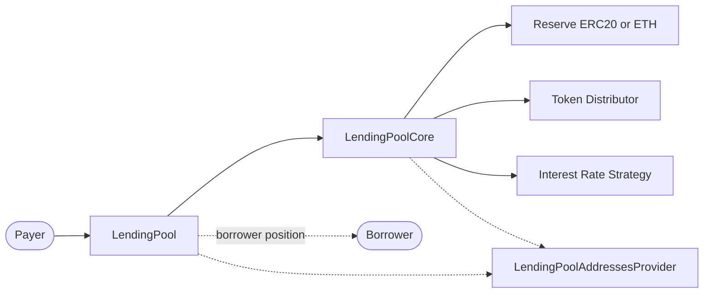

# Repay

The `repay` feature lets an account reduce a user's outstanding borrow for an
underlying reserve asset. It first settles the borrower's outstanding
origination fee, then applies any remaining payment to the debt, including
interest accrued since the user's previous borrow-state update.

The caller starts the operation on `LendingPool`. The pool reads the current
debt from `LendingPoolCore`, determines the usable payment, and tells the core
to update the user and reserve accounting. The core then pulls ERC20 tokens
from the payer, or receives native ETH, and routes the fee to the token
distributor.

This document is a rebuild map. It lists the contracts involved and the
functions that must exist for `LendingPool.repay()` to work.

## Repay Goal

```text
Alice owes DAI debt plus an origination fee
Alice (or Bob) repays DAI
The fee goes to the token distributor
The debt payment returns to LendingPoolCore liquidity
Alice's DAI debt and fee decrease
```

For example, suppose Alice's stored debt is `100 DAI`, `3 DAI` of interest has
accrued, and she has a `1 DAI` outstanding origination fee:

```text
compounded debt       = 103 DAI
outstanding fee       =   1 DAI
total amount owed     = 104 DAI
```

If Alice repays `40 DAI`, the fee has priority:

```text
fee paid              =  1 DAI
debt repaid           = 39 DAI
remaining debt        = 64 DAI
remaining fee         =  0 DAI
```

A full repayment clears the borrow state, but it does not withdraw collateral.
The borrower redeems deposited collateral in a separate operation.

## High-Level Flow

For ERC20 reserves, the payer must approve `LendingPoolCore` to pull the
payment. For the native-ETH reserve, the payer supplies ETH as `msg.value`.

```text
Payer
  |
  | repay(reserve, amount, onBehalfOf)
  v
LendingPool
  |
  | reads compounded debt and fee; resolves full or partial payment
  | updateStateOnRepay(reserve, borrower, debtPayment, feePayment, interest, closed)
  v
LendingPoolCore
  |
  | materializes interest, reduces debt and reserve borrow totals, reprices reserve
  | transferToFeeCollectionAddress(...) / transferToReserve(...)
  v
Token distributor receives fee; core receives debt payment
```

The important balance changes are:

```text
payer ERC20 balance decreases by fee + debt payment
  (or payer sends that amount as ETH)
core reserve liquidity increases by the debt payment
token distributor receives the fee payment
user principal debt becomes old principal + accrued interest - debt payment
user origination fee decreases by the fee payment
reserve stable or variable total borrows becomes old total + accrued interest - debt payment
```

Every step runs in one transaction. If validation, state accounting, or either
asset transfer reverts, all earlier state changes revert too.

## Contract Interaction Diagram



## Contracts Involved

### `LendingPool`

`LendingPool` is the user-facing entry point. It resolves `LendingPoolCore`
and the addresses provider in its constructor. No price-oracle or collateral
calculation is needed: repayment lowers protocol risk.

Required functions and modifiers:

- `constructor(address _addressesProvider)`
- `repay(address _reserve, uint256 _amount, address payable _onBehalfOf)`
- `onlyActiveReserve(address _reserve)`
- `onlyAmountGreaterThanZero(uint256 _amount)`

External functions called by `repay()`:

- `LendingPoolCore.getUserBorrowBalances(_reserve, _onBehalfOf)`
- `LendingPoolCore.getUserOriginationFee(_reserve, _onBehalfOf)`
- `LendingPoolCore.updateStateOnRepay(...)`
- `LendingPoolCore.transferToFeeCollectionAddress(...)`
- `LendingPoolCore.transferToReserve(...)`
- `LendingPoolAddressesProvider.getTokenDistributor()`

Important validations:

- the call must not be reentrant;
- the reserve must be active;
- `_amount` must be greater than zero;
- `_onBehalfOf` must have a nonzero compounded borrow balance;
- `type(uint256).max` (the full-repayment sentinel) is valid only when the
  caller repays their own loan; and
- for ETH, `msg.value` must be at least the selected payment.

Repay does not use `onlyUnfreezedReserve`. A frozen reserve blocks new risk,
such as deposits and borrows, but it must continue to accept debt reduction.

### `LendingPoolCore`

The core holds the reserve assets and borrow state. Only the registered
`LendingPool` may invoke its repayment update and transfer functions.

Required view functions:

- `getUserBorrowBalances(address _reserve, address _user)`
- `getUserOriginationFee(address _reserve, address _user)`
- `getUserCurrentBorrowRateMode(address _reserve, address _user)`
- `getReserveAvailableLiquidity(address _reserve)`

`getUserBorrowBalances()` returns three values:

```text
stored principal
compounded debt = stored principal + accrued interest
borrow balance increase = compounded debt - stored principal
```

It calculates accrued interest as a view; repayment persists it only through
`updateStateOnRepay()`.

Required state-changing functions:

- `updateStateOnRepay(address _reserve, address _user, uint256 _paybackAmountMinusFees, uint256 _originationFeeRepaid, uint256 _balanceIncrease, bool _repaidWholeLoan)`
- `transferToFeeCollectionAddress(address _token, address _user, uint256 _amount, address _destination)`
- `transferToReserve(address _reserve, address payable _user, uint256 _amount)`
- `_updateReserveStateOnRepay(...)`
- `_updateUserStateOnRepay(...)`
- `_updateReserveInterestRatesAndTimestamp(address _reserve, uint256 _liquidityAdded, uint256 _liquidityTaken)`

`updateStateOnRepay()` first updates the reserve's cumulative indexes. It then
updates the stable or variable borrow total by adding the borrower's newly
accrued interest and subtracting the debt portion of the repayment. For a
stable borrow, both operations update the weighted average stable rate.

The user update stores:

```text
new principal = stored principal + accrued interest - debt payment
new fee       = old fee - fee payment
```

It checkpoints the current variable-borrow index and timestamp. When the
whole compounded debt was repaid, it also clears the stable rate and variable
index, leaving the user with no active borrow-rate mode. Finally, the core
recalculates the reserve rates as though the debt payment has been added to
available liquidity.

`transferToFeeCollectionAddress()` pulls ERC20 tokens from its `_user` to the
token distributor, or forwards ETH to that address. `transferToReserve()`
pulls ERC20 tokens from its `_user` into the core, or accepts ETH and refunds
any ETH above `_amount` to `_user`.

### `LendingPoolAddressesProvider`

The addresses provider supplies the token distributor that receives
origination-fee payments.

Required function:

- `getTokenDistributor()`

## Payment Resolution

`_amount` is either an explicit maximum payment or `type(uint256).max`, which
means “repay everything” for self-repayment. The pool begins with the complete
amount owed and caps it only for a smaller explicit amount:

```text
total owed = compounded debt + outstanding fee
payment    = min(explicit amount, total owed)
```

Consequently, an explicit amount larger than the debt never overpays. The fee
is always allocated first:

```text
if payment <= fee:
    fee payment  = payment
    debt payment = 0
else:
    fee payment  = fee
    debt payment = payment - fee
```

The full-repayment flag is true only when `debt payment == compounded debt`.
Thus, paying the final fee alone does not falsely clear a debt position.

## ERC20 and ETH Transfer Details

For a normal ERC20 repayment, both fee and debt transfers pull from
`msg.sender`. This supports repayment on behalf of another user: Bob approves
the core and calls `repay(DAI, 104 DAI, Alice)`.

There is one implementation-specific fee-only case. When the selected payment
does not exceed the outstanding fee, the pool calls
`transferToFeeCollectionAddress()` with `_onBehalfOf` as the ERC20 source.
The borrower therefore needs the tokens and allowance even if someone else
submitted that fee-only transaction. For ETH, the supplied `msg.value` pays
the selected amount in either branch.

For normal ETH repayment, the pool sends the fee separately and forwards the
remaining `msg.value` to `transferToReserve()`. The core retains exactly the
debt payment and refunds excess ETH to the caller.

## Complete Repayment Example

Using the earlier position, Alice approves `LendingPoolCore` for `104 DAI`
and calls:

```solidity
lendingPool.repay(DAI, type(uint256).max, payable(alice));
```

```text
1. The pool reads 103 DAI compounded debt and a 1 DAI fee.
2. The sentinel resolves to a 104 DAI payment.
3. The core adds 3 DAI accrued interest to total borrows, then subtracts 103 DAI.
4. Alice's borrow state and fee are cleared.
5. 1 DAI goes to the token distributor and 103 DAI returns to core liquidity.
6. The pool emits Repay with debt payment = 103 DAI and fee payment = 1 DAI.
```

The `Repay` event identifies both the borrower (`_onBehalfOf`) and payer
(`msg.sender`). Its debt-amount field excludes fees, while its
`_borrowBalanceIncrease` field records the interest materialized by the
operation.

## Repay Order

```text
validate active reserve and nonzero amount
        ↓
read compounded debt, accrued interest, and outstanding fee
        ↓
resolve full or partial payment; validate ETH value
        ↓
allocate payment to fee first, then debt
        ↓
LendingPoolCore materializes interest, updates borrower and reserve state, and reprices rates
        ↓
send fee to token distributor and debt portion to reserve liquidity
        ↓
emit Repay
```
