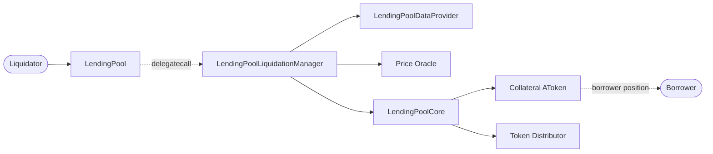

# Liquidation

The `liquidationCall` feature lets a third party repair an unsafe borrowing
position. If a borrower's health factor is below the liquidation threshold, a
liquidator repays part of one debt reserve and receives selected collateral
with that reserve's liquidation bonus.

The caller starts at `LendingPool`. The pool checks both reserves are active
and delegates the calculation and settlement to
`LendingPoolLiquidationManager`. The manager caps and prices the liquidation,
updates `LendingPoolCore` accounting, takes the debt payment, and distributes
the collateral.

This document is a rebuild map for `LendingPool.liquidationCall()`.

## Liquidation Goal

```text
unsafe borrower has debt in one reserve and collateral in another
liquidator repays a bounded part of the debt
liquidator receives collateral worth repayment plus a bonus
borrower has less debt and collateral
remaining selected collateral may settle an origination fee
```

For example, the borrower owes `0.02 WETH`, has `100 DAI` collateral, DAI
costs `0.00025 ETH`, and its liquidation bonus is `105`:

```text
50% close-factor cap                    = 0.01 WETH
value-equivalent collateral             = 0.01 / 0.00025 = 40 DAI
liquidator collateral, including bonus  = 40 * 105 / 100 = 42 DAI
```

A request to repay `0.02 WETH` therefore pays `0.01 WETH` and seizes `42 DAI`.
The final payment can be lower if the selected collateral cannot support it.

## High-Level Flow

For ERC20 debt, the liquidator approves `LendingPoolCore`. For native ETH,
they provide `msg.value`.

```text
Liquidator
  | liquidationCall(collateral, debt reserve, borrower, amount, receiveAToken)
  v
LendingPool
  | validates active reserves; delegatecalls the manager
  v
LendingPoolLiquidationManager (in LendingPool context)
  | validates position; caps repayment; values collateral
  | updateStateOnLiquidation(...)
  v
LendingPoolCore
  | updates debt and reserve accounting; receives repayment
  v
Liquidator receives collateral; token distributor may receive fee collateral
```

```text
liquidator debt-asset balance decreases by actual repayment
core debt-reserve liquidity increases by actual repayment
borrower debt = old stored debt + accrued interest - repayment
borrower fee decreases by liquidated fee
borrower collateral decreases by liquidator collateral + fee collateral
```

Every step is atomic: a failed validation, accounting update, or transfer
reverts the transaction.

## Contract Interaction Diagram



## Contracts Involved

### `LendingPool`

The user-facing entry point is:

```solidity
function liquidationCall(
    address _collateral,
    address _reserve,
    address _user,
    uint256 _purchaseAmount,
    bool _receiveAToken
) external payable nonReentrant onlyActiveReserve(_reserve) onlyActiveReserve(_collateral)
```

`_collateral` is seized; `_reserve` is the debt asset repaid by the
liquidator. `_purchaseAmount` is an upper bound, not a guaranteed payment.
Frozen reserves remain liquidatable because liquidation reduces existing risk.

The pool calls the address returned by
`LendingPoolAddressesProvider.getLendingPoolLiquidationManager()` via
`delegatecall`. A nonzero manager return code becomes
`LendingPool__LiquidationFailed`; a failed delegated call becomes
`LendingPool__LiquidationCallFailed`.

Required functions and modifiers:

- `constructor(address _addressesProvider)`
- `liquidationCall(address _collateral, address _reserve, address _user, uint256 _purchaseAmount, bool _receiveAToken)`
- `onlyActiveReserve(address _reserve)`

### `LendingPoolLiquidationManager`

The manager validates, sizes, and settles liquidation. Users do not call it
directly. `delegatecall` means it uses the pool's storage, retains the
liquidator as `msg.sender`, retains `msg.value`, and emits events from the
pool address.

Its first five storage fields must match the pool's storage order and types:

```solidity
LendingPoolAddressesProvider private s_addressesProvider;
LendingPoolCore private s_core;
LendingPoolDataProvider private s_dataProvider;
LendingPoolParametersProvider private s_parametersProvider;
IFeeProvider private s_feeProvider;
```

It has no constructor: delegated execution uses values initialized in the
pool.

Required functions:

- `liquidationCall(address _collateral, address _reserve, address _user, uint256 _purchaseAmount, bool _receiveAToken)`
- `_calculateAvailableCollateralToLiquidate(address _collateral, address _principal, uint256 _purchaseAmount, uint256 _userCollateralBalance)`

It reads `calculateUserGlobalData(_user)`, core debt/collateral data, oracle
prices, and the token distributor. It rejects a healthy position, absent
selected collateral, collateral disabled globally or by the borrower, no debt
in the selected reserve, and insufficient liquidity for an
underlying-collateral settlement. These expected failures return an error code
for the pool to turn into a revert.

### `LendingPoolCore` and `AToken`

The core holds the underlying reserves and writes liquidation state. The
delegated manager's calls originate from the pool, satisfying the core's
`onlyLendingPool` guard.

Required core functions:

- `getUserUnderlyingAssetBalance(address _reserve, address _user)`
- `getUserBorrowBalances(address _reserve, address _user)`
- `getUserOriginationFee(address _reserve, address _user)`
- `getReserveAvailableLiquidity(address _reserve)`
- `getReserveATokenAddress(address _reserve)`
- `getReserveLiquidationBonus(address _reserve)`
- `isReserveUsageAsCollateralEnabled(address _reserve)`
- `isUserUseReserveAsCollateralEnabled(address _reserve, address _user)`
- `updateStateOnLiquidation(...)`
- `transferToReserve(address _reserve, address payable _user, uint256 _amount)`
- `transferToUser(address _reserve, address payable _user, uint256 _amount)`
- `liquidateFee(address _token, uint256 _amount, address payable _destination)`

`updateStateOnLiquidation()` checkpoints both reserves, materializes interest,
reduces the borrower's debt and fee, and reprices reserves:

```text
new borrower debt = old stored debt + accrued interest - actual repayment
new aggregate debt = old aggregate debt + accrued interest - actual repayment
new borrower fee  = old fee - fee liquidated
```

For stable debt, the aggregate update also adjusts its weighted average stable
rate. For variable debt, it updates the variable total and saves the current
variable-borrow index for the borrower.

Settlement uses the collateral aToken:

```text
_receiveAToken = true   transfer borrower aTokens to liquidator
_receiveAToken = false  burn borrower aTokens; core sends underlying
fee collateral          burn borrower aTokens; core sends underlying to distributor
```

## Validation and Repayment Resolution

The data provider must report a health factor below the threshold. This global
calculation includes collateral weighted by liquidation thresholds, compounded
borrows, and origination fees.

The selected debt balance is:

```text
stored principal
compounded debt = stored principal + accrued interest
borrow balance increase = compounded debt - stored principal
```

Aave V1's fixed 50 percent close factor applies:

```text
maximum repayment = compounded debt * 50 / 100
candidate repayment = min(requested purchase amount, maximum repayment)
```

## Collateral Resolution

The manager uses debt and collateral oracle prices plus the collateral
reserve's liquidation bonus:

```text
collateral to seize =
    debt price * candidate repayment / collateral price
    * liquidation bonus / 100
```

If that exceeds the borrower's selected collateral balance, it seizes all
available selected collateral and lowers the actual repayment to:

```text
supported repayment =
    collateral price * available collateral / debt price
    * 100 / liquidation bonus
```

Thus the actual repayment is limited by both the 50% close factor and
available selected collateral. Integer division rounds down.

## Origination-Fee Liquidation

The origination fee is separate from principal debt and denominated in the
debt reserve. After allocating the liquidator's collateral, the manager uses
any remainder to settle as much fee as possible using the same price-and-bonus
calculation.

```text
fee liquidated                 debt-reserve units; reduces borrower fee
liquidated collateral for fee  collateral-reserve units; goes to distributor
```

Fee collateral is always underlying collateral: corresponding aTokens are
burned and `LendingPoolCore.liquidateFee()` sends it to the token distributor,
even if the liquidator chose aTokens.

## ERC20 and ETH Transfer Details

After accounting and collateral settlement, the manager collects the actual
repayment. For ERC20 debt, `transferToReserve()` pulls from the liquidator, so
approval goes to `LendingPoolCore`, not `LendingPool`.

For ETH debt, the manager forwards `msg.value`. The core requires at least
the actual repayment, retains that amount, and refunds excess ETH. ERC20 debt
repayments reject nonzero `msg.value`.

When underlying collateral is requested, the manager checks available
collateral-reserve liquidity. The aToken path needs no such check because
ownership changes without underlying leaving the core.

## Complete Liquidation Example

```solidity
lendingPool.liquidationCall(DAI, WETH, borrower, 0.02 ether, false);
```

```text
1. DAI is eligible collateral and the health factor is below the threshold.
2. The close factor caps 0.02 WETH at 0.01 WETH.
3. Oracle pricing and the 105 bonus calculate 42 DAI for the liquidator.
4. Core accounting materializes interest and reduces the WETH debt.
5. The borrower's 42 aDAI is burned and the liquidator receives 42 DAI.
6. The core pulls 0.01 WETH from the liquidator into the WETH reserve.
7. Remaining DAI collateral may settle an origination fee for the distributor.
8. The pool emits `LiquidationCall` and, where applicable,
   `OriginationFeeLiquidated`.
```

With `_receiveAToken = true`, step 5 transfers `42 aDAI` instead and the
underlying DAI remains in the core.

## Liquidation Order

```text
validate active debt and collateral reserves
        ↓
delegate to the liquidation manager
        ↓
validate health, collateral configuration, and debt
        ↓
cap repayment at 50% of compounded debt
        ↓
price liquidator collateral and reduce repayment if it is insufficient
        ↓
calculate collateral for any origination fee
        ↓
check liquidity for underlying collateral
        ↓
update accounting; settle collateral, repayment, fee, and events
```
