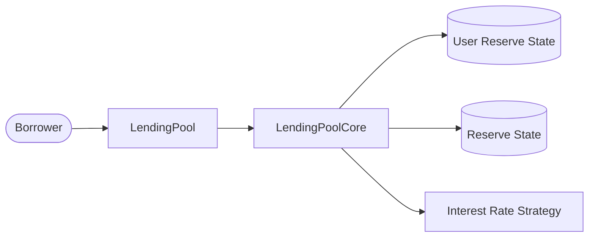

# Swap Borrow Rate Mode

The `swapBorrowRateMode` feature lets a borrower move an existing loan from
stable interest to variable interest, or from variable interest to stable
interest. The operation changes how the debt accrues from that point forward.
It does not send underlying assets, alter collateral, repay the origination
fee, or create a second loan.

The borrower starts the operation on `LendingPool`. The pool reads the
borrower's current interest-inclusive debt and rate mode from
`LendingPoolCore`. A variable-to-stable swap also passes the stable-borrow
eligibility check. The core then materializes accrued interest, moves the debt
between the reserve's stable and variable totals, replaces the user's
rate-specific state, and recalculates the reserve rates.

This document is a rebuild map. It lists the contracts involved and the
functions that must exist for `LendingPool.swapBorrowRateMode()` to work.

## Swap Goal

```text
Alice has one existing borrow position
Alice chooses the opposite interest-rate mode
Accrued interest is added to her stored principal
Her complete current debt moves to the destination rate bucket
The debt continues accruing under the new mode
```

For example, suppose Alice's stored stable debt is `100 DAI` and `3 DAI` of
interest has accrued:

```text
stored principal       = 100 DAI
accrued interest       =   3 DAI
compounded debt        = 103 DAI
```

After a stable-to-variable swap:

```text
stable debt removed    = 100 DAI
variable debt added    = 103 DAI
new stored principal   = 103 DAI
new mode               = VARIABLE
```

The `3 DAI` difference is not newly borrowed liquidity. It is interest that
already accrued and is now persisted in both the user's principal and the
reserve's destination debt total.

## High-Level Flow

Only the borrower can swap their position because the function always uses
`msg.sender` as the user. No ERC20 approval or ETH payment is required.

```text
Borrower
  |
  | swapBorrowRateMode(reserve)
  v
LendingPool
  |
  | reads principal, compounded debt, accrued interest, and current mode
  | checks stable-rate eligibility when the destination is STABLE
  | updateStateOnSwapRate(...)
  v
LendingPoolCore
  |
  | checkpoints indexes and moves debt to the opposite rate bucket
  | updates the user's principal, mode-specific rate data, and timestamp
  | recalculates reserve rates with no liquidity movement
  v
Interest Rate Strategy
```

The important state changes are:

```text
user principal becomes old principal + accrued interest
source borrow total loses the old stored principal
destination borrow total gains the current compounded debt
user stable rate or variable-index checkpoint is replaced
reserve liquidity, user token balance, collateral, and fee remain unchanged
```

Every step runs in one transaction. If validation or core accounting reverts,
all earlier state changes revert too.

## Contract Interaction Diagram



## Contracts Involved

### `LendingPool`

`LendingPool` is the user-facing entry point. It identifies the position by
combining `_reserve` with `msg.sender`; there is no `onBehalfOf` parameter.

Required function and modifiers:

- `swapBorrowRateMode(address _reserve)`
- `nonReentrant`
- `onlyActiveReserve(address _reserve)`
- `onlyUnfreezedReserve(address _reserve)`

External functions called by `swapBorrowRateMode()`:

- `LendingPoolCore.getUserBorrowBalances(_reserve, msg.sender)`
- `LendingPoolCore.getUserCurrentBorrowRateMode(_reserve, msg.sender)`
- `LendingPoolCore.isUserAllowedToBorrowAtStable(...)`
- `LendingPoolCore.updateStateOnSwapRate(...)`

Important validations:

- the call must not be reentrant;
- the reserve must be active;
- the reserve must not be frozen;
- the caller must have a nonzero compounded borrow balance; and
- when swapping from variable to stable, the caller must be allowed to borrow
  the compounded balance at a stable rate.

A frozen reserve permits risk-reducing actions such as repay and redeem, but
does not permit a borrower to open a new rate position through a swap.

### `LendingPoolCore`

The core owns the user and reserve borrow accounting. Only the registered
`LendingPool` may invoke its swap state-update entry point.

Required view functions:

- `getUserBorrowBalances(address _reserve, address _user)`
- `getUserCurrentBorrowRateMode(address _reserve, address _user)`
- `isUserAllowedToBorrowAtStable(address _reserve, address _user, uint256 _amount)`
- `getUserUnderlyingAssetBalance(address _reserve, address _user)`

`getUserBorrowBalances()` returns:

```text
principalBorrowBalance   debt stored at the previous user checkpoint
compoundedBorrowBalance  principal plus interest accrued since that checkpoint
borrowBalanceIncrease    compounded balance - principal
```

The current rate mode is encoded as:

```text
NONE      = 0  when principalBorrowBalance is zero
STABLE    = 1  when stableBorrowRate is nonzero
VARIABLE  = 2  when debt exists and stableBorrowRate is zero
```

Required state-changing and internal functions:

- `updateStateOnSwapRate(...)`
- `_updateReserveStateOnSwapRate(...)`
- `_updateUserStateOnSwapRate(...)`
- `_updateReserveInterestRatesAndTimestamp(_reserve, 0, 0)`
- `_getUserCurrentBorrowRate(address _reserve, address _user)`

`updateStateOnSwapRate()` coordinates the reserve update, user update, and
interest-rate recalculation. It returns the new mode and the rate that applies
to the user after the swap so that `LendingPool` can emit them in `Swap`.

### `CoreLibrary`

`CoreLibrary` supplies the debt structures, rate-mode enum, index update, and
borrow-total helpers used by the core.

Required types and functions:

- `InterestRateMode { NONE, STABLE, VARIABLE }`
- `ReserveData.updateCumulativeIndexes()`
- `ReserveData.decreaseTotalBorrowsStableAndUpdateAverageRate(...)`
- `ReserveData.increaseTotalBorrowsStableAndUpdateAverageRate(...)`
- `ReserveData.decreaseTotalBorrowsVariable(...)`
- `ReserveData.increaseTotalBorrowsVariable(...)`
- `getCompoundedBorrowBalance(...)`

### `IReserveInterestRateStrategy`

After moving the debt, the core calls the reserve's strategy through:

- `calculateInterestRates(...)`

The strategy receives the unchanged available liquidity, the updated stable
and variable borrow totals, and the updated average stable borrow rate. It
returns new liquidity, stable-borrow, and variable-borrow rates.

## Stable-Rate Eligibility

The special eligibility check runs only for a variable-to-stable swap. A
stable-to-variable swap does not need it because variable borrowing has no
equivalent stable-rate restriction.

Stable borrowing must first be enabled on the reserve. The same-asset
collateral restriction then allows the swap when at least one condition is
true:

```text
the user is not using this reserve as collateral
OR the reserve is not enabled for use as collateral
OR compounded debt is greater than the user's underlying balance in this reserve
```

Equivalently, the check rejects a variable-to-stable swap when the user is
using the borrowed reserve as collateral, that reserve supports collateral,
and the user's deposited underlying balance is at least as large as the debt
being swapped.

This prevents a borrower from depositing the same asset, using that deposit
to influence reserve utilization and rates, borrowing it at variable rate,
and then locking the resulting rate as stable. Failure reverts with
`LendingPool__UserCannotBorrowAtStable`.

## Reserve Accounting

Before moving debt, `_updateReserveStateOnSwapRate()` calls
`updateCumulativeIndexes()`. This checkpoints liquidity-index and
variable-borrow-index growth under the rates that existed before the swap.

The source and destination amounts deliberately differ:

```text
source aggregate      -= principalBorrowBalance
destination aggregate += compoundedBorrowBalance
```

Removing the old stored principal avoids subtracting interest that was never
previously materialized in the source total. Adding the compounded balance
records that interest in the destination total.

### Stable to Variable

The core removes the stored principal from `totalBorrowsStable` at the user's
existing `stableBorrowRate`. The helper also recalculates the reserve's
weighted average stable rate. It then adds the complete compounded balance to
`totalBorrowsVariable`.

```text
totalBorrowsStable   -= principalBorrowBalance
totalBorrowsVariable += compoundedBorrowBalance
```

### Variable to Stable

The core removes the stored principal from `totalBorrowsVariable`. It then
adds the complete compounded balance to `totalBorrowsStable` at the reserve's
currently offered stable rate. The helper folds that debt and rate into the
reserve's weighted average stable borrow rate.

```text
totalBorrowsVariable -= principalBorrowBalance
totalBorrowsStable   += compoundedBorrowBalance
```

If the supplied current mode is `NONE` or any value other than `STABLE` or
`VARIABLE`, the core reverts with `LendingPoolCore__InvalidBorrowRateMode`.

## User Accounting

`_updateUserStateOnSwapRate()` first replaces the mode-specific fields.

For variable to stable:

```text
stableBorrowRate = reserve.currentStableBorrowRate
lastVariableBorrowCumulativeIndex = 0
new mode = STABLE
```

The stable rate is captured before the reserve rates are recalculated, so it
is the rate offered when the swap was accepted.

For stable to variable:

```text
stableBorrowRate = 0
lastVariableBorrowCumulativeIndex = reserve.lastVariableBorrowCumulativeIndex
new mode = VARIABLE
```

The variable-index snapshot makes future variable interest accrue from the
index checkpoint produced during this swap.

In both directions, the user update materializes accrued interest and moves
the timestamp forward:

```text
new principalBorrowBalance = old principalBorrowBalance + borrowBalanceIncrease
lastUpdateTimestamp        = block.timestamp
```

The origination fee is not modified.

## Reserve Repricing

After the debt and user state have moved, the core calls:

```solidity
_updateReserveInterestRatesAndTimestamp(_reserve, 0, 0);
```

Both liquidity deltas are zero because a swap transfers no assets. The
interest-rate strategy still runs because the split between stable and
variable debt, and possibly the average stable rate, changed. The core stores
the returned rates, advances the reserve timestamp, and emits
`ReserveUpdated`.

The rate returned to `LendingPool` depends on the destination mode:

- for `STABLE`, it is the stable rate captured on the user's position before
  repricing; and
- for `VARIABLE`, it is the reserve's newly recalculated variable rate.

## No Asset, Collateral, or Fee Movement

A rate-mode swap is an accounting-only action:

```text
borrower underlying balance     unchanged
core underlying balance         unchanged
borrower aToken balance         unchanged
collateral configuration        unchanged
origination fee                 unchanged
available reserve liquidity     unchanged
```

Consequently, the call is not `payable`, does not inspect `msg.value`, and
does not call either `transferToReserve()` or
`transferToFeeCollectionAddress()`.

## Stable-to-Variable Example

Assume Alice has a `100 DAI` stable loan at `5%`, and `3 DAI` of interest has
accrued. She calls:

```solidity
lendingPool.swapBorrowRateMode(DAI);
```

```text
1. The pool reads 100 DAI principal, 103 DAI compounded debt, and 3 DAI accrued interest.
2. The pool identifies Alice's current mode as STABLE.
3. The core checkpoints the reserve indexes.
4. The core removes 100 DAI from stable borrows and adds 103 DAI to variable borrows.
5. Alice's stable rate is cleared and her variable-index checkpoint is stored.
6. Alice's stored principal becomes 103 DAI.
7. The reserve rates are recalculated without moving liquidity.
8. The pool emits Swap with mode VARIABLE, the new variable rate, and a 3 DAI balance increase.
```

## Variable-to-Stable Example

Assume Bob has `100 DAI` variable debt, `3 DAI` of interest has accrued, the
reserve currently offers a `6%` stable rate, and Bob passes the stable-rate
eligibility check:

```text
1. The pool reads 100 DAI principal, 103 DAI compounded debt, and 3 DAI accrued interest.
2. The pool identifies Bob's current mode as VARIABLE and validates stable borrowing.
3. The core checkpoints the reserve indexes.
4. The core removes 100 DAI from variable borrows and adds 103 DAI to stable borrows at 6%.
5. Bob's stable rate becomes 6% and his variable-index checkpoint is cleared.
6. Bob's stored principal becomes 103 DAI.
7. The reserve rates are recalculated without moving liquidity.
8. The pool emits Swap with mode STABLE, rate 6%, and a 3 DAI balance increase.
```

## `Swap` Event

```solidity
event Swap(
    address indexed _reserve,
    address indexed _user,
    uint256 _newRateMode,
    uint256 _newRate,
    uint256 _borrowBalanceIncrease,
    uint256 _timestamp
);
```

The event reports the destination mode, the rate applying after the swap, and
the interest materialized by the action. It does not report a transferred
amount because no underlying funds move.


