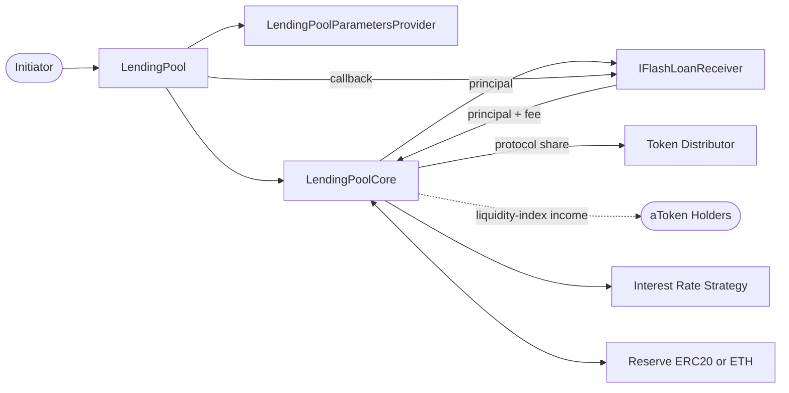

# Flash Loan

The `flashLoan` feature lends reserve liquidity to a receiver contract for the
duration of one transaction. The receiver can use the funds during its callback,
but it must return the complete principal plus the fee before control returns to
`LendingPool`. If it does not, the entire transaction reverts.

Unlike a normal borrow, a flash loan creates no user debt, requires no
collateral, and has no stable or variable interest rate. Its safety comes from
transaction atomicity and a balance invariant: either the Core finishes with
the original liquidity plus the exact fee, or none of the transaction persists.

This document is a rebuild map. It lists the contracts involved and follows the
complete flow from `LendingPool.flashLoan()` through the receiver callback and
the final reserve accounting.

## Flash Loan Goal

```text
LendingPoolCore holds reserve liquidity
A receiver borrows part of it for one transaction
The receiver performs an arbitrary operation
The receiver returns principal plus the total fee
The protocol share goes to the token distributor
The remaining fee increases depositor yield
```

The current parameters are expressed in basis points:

```text
total flash-loan fee = 35 bps = 0.35% of principal
protocol share       = 3000 bps = 30% of the total fee
depositor share      = 70% of the total fee
```

For a `10 DAI` flash loan:

```text
principal             = 10.0000 DAI
total fee             =  0.0350 DAI
protocol share        =  0.0105 DAI
depositor share       =  0.0245 DAI
receiver must return  = 10.0350 DAI
```

After settlement, the receiver no longer has the borrowed principal, the token
distributor has `0.0105 DAI`, and the Core has its original liquidity plus
`0.0245 DAI` for depositors.

## High-Level Flow

```text
Flash-loan initiator
  |
  | flashLoan(receiver, reserve, amount, params)
  v
LendingPool
  |
  | validates reserve, amount, liquidity, and nonzero fees
  | transferToUser(reserve, receiver, amount)
  v
LendingPoolCore ----------------------> Receiver
                                           |
                                           | executeOperation(reserve, amount, fee, params)
                                           | performs arbitrary logic
                                           | transfers amount + fee directly to Core
                                           v
LendingPool checks Core balance after callback
  |
  | updateStateOnFlashLoan(reserve, liquidityBefore, depositorFee, protocolFee)
  v
LendingPoolCore
  |
  | sends protocol fee to token distributor
  | adds depositor fee to the liquidity index
  | refreshes reserve rates and timestamp
  v
FlashLoan event
```

Every step occurs in the same transaction. A failed transfer, a receiver
revert, an invalid ending balance, or a failure during reserve accounting rolls
back the initial loan transfer and every action performed by the receiver.

## Contract Interaction Diagram



The initiator and receiver do not need to be the same address. The initiator
chooses the receiver and supplies `_params`; the receiver contract owns the
callback logic and is responsible for repayment.

## Contracts Involved

### `LendingPool`

`LendingPool` is the public entry point and coordinates the complete operation:

```solidity
function flashLoan(
    address _receiver,
    address _reserve,
    uint256 _amount,
    bytes memory _params
) external
```

Required modifiers and external calls:

- `nonReentrant`
- `onlyActiveReserve(_reserve)`
- `onlyAmountGreaterThanZero(_amount)`
- `LendingPoolParametersProvider.getFlashLoanFeesInBips()`
- `LendingPoolCore.transferToUser(...)`
- `IFlashLoanReceiver.executeOperation(...)`
- `LendingPoolCore.updateStateOnFlashLoan(...)`

The function does not use `onlyUnfreezedReserve`, so this implementation permits
a flash loan from a frozen reserve as long as that reserve remains active and
has enough liquidity.

### `LendingPoolParametersProvider`

The parameters provider defines the two fee constants:

```solidity
uint256 private constant FLASHLOAN_FEE_TOTAL = 35;
uint256 private constant FLASHLOAN_FEE_PROTOCOL = 3000;
```

`getFlashLoanFeesInBips()` returns both values. The first is applied to the
principal, and the second is applied to the resulting fee, not to the principal
again:

```text
total fee       = amount * 35 / 10,000
protocol fee    = total fee * 3,000 / 10,000
depositor income = total fee - protocol fee
```

All calculations use integer division and therefore round down.

### `IFlashLoanReceiver`

The receiver must implement:

```solidity
function executeOperation(
    address _reserve,
    uint256 _amount,
    uint256 _fee,
    bytes calldata _params
) external;
```

The pool transfers the principal before invoking this callback. During the
callback, the receiver may exchange assets, liquidate a position, refinance a
loan, or perform any other atomic operation. Before returning, it must transfer
`_amount + _fee` to `LendingPoolCore`.

The callback has no Boolean return value. Success is established by the call
not reverting and by the pool's post-callback balance check.

### `FlashLoanReceiverBase`

`FlashLoanReceiverBase` is an optional base contract for receiver
implementations. It resolves the current Core through
`ILendingPoolAddressesProvider` and provides:

- `_getBalance(target, reserve)` for ERC20 and native-ETH balances;
- `_transfer(destination, reserve, amount)` for ERC20 and ETH transfers; and
- `_transferFundsBackToPool(reserve, amount)` to push repayment to Core.

The receiver pushes assets directly to Core. It does not approve Core and wait
for the pool to pull them.

The base contract does not restrict who may call `executeOperation`, because
that function remains abstract. A production receiver should authenticate the
callback caller and protect any receiver-owned funds according to its design.

### `LendingPoolCore`

The Core holds reserve liquidity and performs three flash-loan tasks:

- `transferToUser()` sends the principal to the receiver;
- `updateStateOnFlashLoan()` distributes the fee and updates reserve state; and
- `_transferFlashLoanProtocolFee()` sends the protocol share to the token
  distributor resolved from the addresses provider.

Both public Core functions are protected by `onlyLendingPool`, so an arbitrary
account cannot use the Core to transfer liquidity or finalize accounting.

### `CoreLibrary`

`CoreLibrary.cumulateToLiquidityIndex()` distributes one-off income across
liquidity providers by increasing the reserve liquidity index:

```text
new liquidity index
    = old liquidity index * (1 + depositor income / total liquidity before)
```

Because aToken balances derive from this index, holders receive the depositor
share proportionally without iterating over individual accounts.

## Step 1: Validate the Request

`flashLoan()` first rejects reentrancy, an inactive reserve, and a zero amount.
It then reads the Core's actual balance:

```solidity
uint256 availableLiquidityBefore = _reserve == EthAddressLib.ethAddress()
    ? address(s_core).balance
    : IERC20(_reserve).balanceOf(address(s_core));
```

This value serves two purposes: it proves that the requested principal is
available and becomes the baseline for the repayment invariant. If it is less
than `_amount`, the call reverts with
`LendingPool__InsufficientLiquidityToBorrow`.

Using the actual ETH or token balance also means unsolicited transfers to Core
are included in the baseline.

## Step 2: Calculate the Fee

The pool reads both fee rates and calculates:

```solidity
uint256 amountFee = _amount * totalFeeBips / 10_000;
uint256 protocolFee = amountFee * protocolFeeBips / 10_000;
```

If either result is zero, the amount is too small after integer rounding and
the function reverts with `LendingPool__InsufficientAmountForFlashLoan`.

With the current constants, the principal must therefore be large enough to
produce both a nonzero total fee and a nonzero 30% protocol share in the
reserve's smallest unit.

## Step 3: Transfer the Principal

The pool casts `_receiver` to `IFlashLoanReceiver` and asks Core to transfer the
principal:

```solidity
s_core.transferToUser(_reserve, payable(_receiver), _amount);
```

For an ERC20 reserve, Core uses `safeTransfer`. For the native-ETH sentinel, it
sends ETH with a low-level call and reverts if the transfer fails. Core's
balance temporarily changes from:

```text
availableLiquidityBefore
```

to:

```text
availableLiquidityBefore - amount
```

No reserve debt or user borrow record is created.

## Step 4: Execute the Receiver Callback

After the transfer, the pool calls:

```solidity
receiver.executeOperation(_reserve, _amount, amountFee, _params);
```

`_params` is opaque to the pool and is forwarded unchanged. A receiver can
decode it to select a route, identify another protocol, enforce a minimum
profit, or carry any other operation-specific data.

The receiver must obtain the fee in addition to preserving the principal. At
the end of the callback it pushes:

```text
amount + amountFee
```

to Core. For an ERC20 loan, that can be a direct token transfer. For native
ETH, the receiver sends ETH to Core. If the receiver's operation does not earn
the fee, the receiver must already own enough of the reserve asset to cover it.

## Step 5: Enforce Exact Repayment

When the callback returns, the pool reads the Core's actual balance again and
requires:

```text
availableLiquidityAfter == availableLiquidityBefore + amountFee
```

The arithmetic captures the complete flow:

```text
starting Core balance              = liquidityBefore
principal sent to receiver         = -amount
principal and fee returned         = +(amount + amountFee)
required ending Core balance       = liquidityBefore + amountFee
```

A shortfall of even one smallest token unit reverts. The equality check also
rejects an overpayment or another unexpected balance increase during the
callback; repayment must be exact. Tokens whose transfers modify balances in
unexpected ways, such as fee-on-transfer or rebasing tokens, may therefore be
incompatible with this flow.

## Step 6: Distribute the Fee

After repayment has been proven, the pool calls:

```solidity
s_core.updateStateOnFlashLoan(
    _reserve,
    availableLiquidityBefore,
    amountFee - protocolFee,
    protocolFee
);
```

Inside Core, the operation proceeds in this order:

```text
1. Transfer protocolFee to the token distributor.
2. Update cumulative reserve indexes for time-based interest.
3. Compute total liquidity before the flash loan.
4. Add the depositor income to the liquidity index.
5. Recalculate reserve rates and update the timestamp.
```

The index denominator includes both cash and outstanding debt:

```solidity
totalLiquidityBefore = availableLiquidityBefore + getReserveTotalBorrows(_reserve);
```

Only `amountFee - protocolFee` is distributed through the liquidity index. The
protocol portion has already left Core for the token distributor.

The current implementation then calls
`_updateReserveInterestRatesAndTimestamp(_reserve, income, 0)`. That helper
reads Core's post-distribution balance and also adds `income` for the rate
strategy calculation. Consequently, the rate-strategy input counts the retained
depositor income once in the actual balance and once through `_liquidityAdded`.
This is an implementation detail to keep in mind when rebuilding or reviewing
the rate update.

## Step 7: Emit the Event

The pool finishes by emitting:

```solidity
FlashLoan(
    _receiver,
    _reserve,
    _amount,
    amountFee,
    protocolFee,
    block.timestamp
);
```

The event records the total fee and protocol share separately. The depositor
share can be reconstructed as `_totalFee - _protocolFee`.

## ERC20 and ETH Details

For an ERC20 reserve:

- Core transfers the principal to the receiver with `safeTransfer`;
- the receiver transfers principal plus fee directly back to Core; and
- Core transfers the protocol share to the token distributor with
  `safeTransfer`.

No approval is required for repayment because Core does not pull tokens from
the receiver.

For the native-ETH reserve:

- the reserve is identified by `EthAddressLib.ethAddress()`;
- Core sends the principal to the receiver with a low-level call;
- the receiver returns principal plus fee to Core; and
- Core forwards the protocol share as ETH to the token distributor.

The receiver must be able to receive ETH and must have or earn the extra ETH
needed for the fee. `FlashLoanReceiverBase` supplies payable `receive()` and
`fallback()` functions for this purpose.

## Complete Flash Loan Example

The integration test starts Core with `100 DAI` and requests `10 DAI` through
`MockFlashLoanReceiver`:

```solidity
pool.flashLoan(
    address(receiver),
    address(dai),
    10 ether,
    bytes("")
);
```

The mock mints the fee only to model a profitable receiver operation. A real
receiver cannot normally mint the reserve asset; it must earn the fee or fund
it in advance.

```text
1. Core begins with 100 DAI.
2. The pool calculates a 0.035 DAI total fee.
3. Core sends 10 DAI to the receiver and temporarily holds 90 DAI.
4. The mock obtains 0.035 DAI and returns 10.035 DAI.
5. Core now holds 100.035 DAI, satisfying the exact invariant.
6. Core sends 0.0105 DAI to the token distributor.
7. Core retains 100.0245 DAI; the 0.0245 DAI income goes into the liquidity index.
8. The pool emits FlashLoan and the receiver finishes with 0 DAI.
```

The test verifies the receiver's final balance, the token distributor's
protocol fee, and Core's original liquidity plus the depositor share.

## Failure and Security Properties

The complete transaction reverts when:

- the reserve is inactive;
- the amount is zero;
- Core has insufficient liquidity;
- fee rounding produces a zero total or protocol fee;
- the principal transfer fails;
- `executeOperation()` reverts;
- the receiver returns too little or too much;
- the protocol-fee transfer fails; or
- reserve index or interest-rate accounting reverts.

`nonReentrant` prevents the receiver callback from entering another protected
`LendingPool` operation while the flash loan is in progress. Receiver contracts
still need their own access control, slippage checks, profitability checks, and
safe handling of arbitrary `_params`. Transaction atomicity guarantees
repayment to the pool; it does not guarantee that the receiver's strategy is
profitable or resistant to manipulation.
