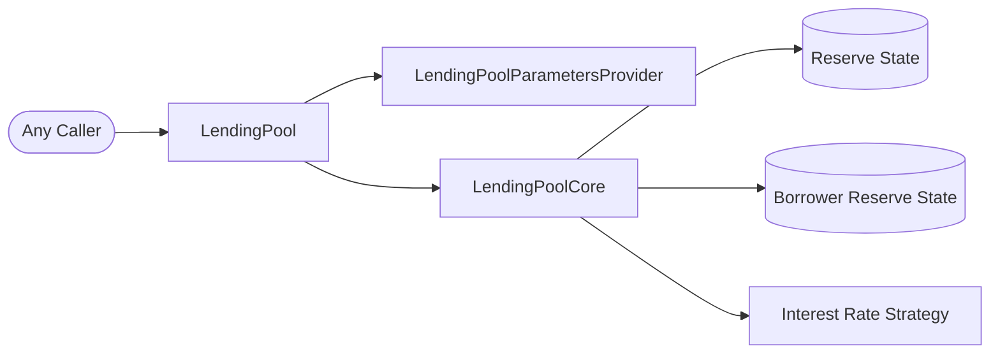

# Stable Borrow Rate Rebalance

The `rebalanceStableBorrowRate` feature replaces the rate of an existing
stable-rate loan when that rate has become unfavorable either to the reserve or
to the borrower. It does not create a new loan, transfer reserve assets, change
collateral, or switch the debt to variable rate.

The operation is permissionless: any address can request a rebalance for a
specific borrower. `LendingPool` decides whether the position is eligible, and
`LendingPoolCore` capitalizes the interest accrued so far, resets the user's
stable rate to the reserve's current stable rate, and refreshes reserve-wide
interest rates.

This document is a rebuild map. It lists the contracts involved and follows the
complete flow from `LendingPool.rebalanceStableBorrowRate()` through the Core's
reserve and user accounting.

## Rebalance Goal

```text
A borrower already has stable-rate debt
The stored rate becomes materially too low or too high
Anyone calls rebalanceStableBorrowRate(reserve, borrower)
Accrued interest is added to the borrower's stored principal
The borrower's stable rate is reset to the reserve's quoted stable rate
Reserve interest rates are recalculated
```

There are two reasons a position may be rebalanced:

```text
upward-protection condition: user stable rate < reserve liquidity rate

downward-protection condition:
    user stable rate > reserve stable rate * (1 + rebalance delta)
```

The first condition protects the pool when the borrower pays less than
depositors currently earn. Otherwise, a borrower could redeposit the borrowed
asset into the same reserve and earn more than the loan costs.

The second condition protects the borrower from remaining at a stable rate
that is materially above the rate currently offered by the reserve. In this
implementation, the rebalance delta is `0.2 ray`, or 20%, so the old user rate
must be strictly greater than 120% of the current reserve stable rate.

## High-Level Flow

```text
Any caller
  |
  | rebalanceStableBorrowRate(reserve, borrower)
  v
LendingPool
  |
  | verifies that the reserve is active
  | reads the borrower's current interest-inclusive debt
  | requires an existing STABLE-rate position
  | reads the user, liquidity, and reserve stable rates
  | checks either rebalance condition
  | updateStateOnRebalance(reserve, borrower, accruedInterest)
  v
LendingPoolCore
  |
  | updates reserve cumulative indexes
  | adds accrued interest to total stable debt at the user's old rate
  | adds accrued interest to the user's stored principal
  | replaces the user's stable rate with the current reserve stable rate
  | updates the user's timestamp
  | recalculates reserve interest rates and timestamp
  v
LendingPool emits RebalanceStableBorrowRate
```

The operation only changes accounting state. There is no ERC20 or ETH transfer,
no approval, no origination-fee payment, and no change to the caller's or
borrower's token balance.

## Contract Interaction Diagram



The caller and `_user` may be different addresses. The caller pays the gas, but
the `_user` position is the one inspected and updated.

## Contracts Involved

### `LendingPool`

`LendingPool` is the public entry point and enforces all rebalance eligibility
rules:

```solidity
function rebalanceStableBorrowRate(address _reserve, address _user)
    external
    nonReentrant
    onlyActiveReserve(_reserve)
```

It calls these read functions before changing state:

- `LendingPoolCore.getUserBorrowBalances()`;
- `LendingPoolCore.getUserCurrentBorrowRateMode()`;
- `LendingPoolCore.getUserCurrentStableBorrowRate()`;
- `LendingPoolCore.getReserveCurrentLiquidityRate()`;
- `LendingPoolCore.getReserveCurrentStableBorrowRate()`; and
- `LendingPoolParametersProvider.getRebalanceDownRateDelta()`.

If either rate condition holds, it calls
`LendingPoolCore.updateStateOnRebalance()` and emits
`RebalanceStableBorrowRate`.

The function has `onlyActiveReserve` but not `onlyUnfreezedReserve`. A stable
loan can therefore be rebalanced while its reserve is frozen, provided the
reserve is still active.

### `LendingPoolParametersProvider`

The parameters provider defines the downward-rebalance delta:

```solidity
uint256 private constant REBALANCE_DOWN_RATE_DELTA = 1e27 / 5;
```

Rates use ray precision, where `1 ray = 1e27` represents 100%. The constant is
therefore 20%, and the threshold calculation is:

```solidity
rebalanceDownRateThreshold = reserveCurrentStableRate.rayMul(
    WadRayMath.ray() + getRebalanceDownRateDelta()
);
```

Conceptually:

```text
threshold = current reserve stable rate * 1.20
```

`rayMul` applies fixed-point rounding according to `WadRayMath`; this is not
ordinary unscaled integer multiplication.

### `LendingPoolCore`

The Core stores both sides of the debt accounting:

- per-user principal, stable rate, and last update timestamp;
- reserve total stable debt and weighted-average stable rate;
- reserve liquidity and variable-borrow indexes; and
- the reserve's current liquidity, stable-borrow, and variable-borrow rates.

Its public state-changing entry point is:

```solidity
function updateStateOnRebalance(
    address _reserve,
    address _user,
    uint256 _balanceIncrease
) external onlyLendingPool returns (uint256)
```

`onlyLendingPool` prevents callers from bypassing the eligibility checks by
calling the Core directly.

### `CoreLibrary`

`CoreLibrary.getCompoundedBorrowBalance()` calculates current stable debt from
the stored principal, the user's stored stable rate, and the elapsed time:

```text
compounded debt = principal * (1 + stableRate / secondsPerYear) ^ elapsedSeconds
accrued interest = compounded debt - stored principal
```

The calculation uses wad/ray fixed-point arithmetic. It is initially a view
calculation; the interest becomes stored principal only after the Core performs
the rebalance.

`CoreLibrary.updateCumulativeIndexes()` checkpoints the reserve indexes, while
`increaseTotalBorrowsStableAndUpdateAverageRate()` adds the newly materialized
interest to reserve stable debt and updates the reserve's weighted-average
stable rate.

### `IReserveInterestRateStrategy`

After the debt state is updated, Core asks the reserve's configured strategy to
calculate new liquidity, stable-borrow, and variable-borrow rates. The strategy
receives:

- actual available reserve liquidity;
- total stable debt;
- total variable debt; and
- the reserve's average stable borrow rate.

No liquidity adjustment is passed for a rebalance because no assets enter or
leave Core.

## Step 1: Enter Through an Active Reserve

The caller supplies both the reserve and borrower:

```solidity
pool.rebalanceStableBorrowRate(reserve, borrower);
```

The caller does not need to be the borrower or an administrator. The only
entry-point modifiers are:

- `nonReentrant`, which prevents nested entry into protected pool operations;
- `onlyActiveReserve`, which rejects an inactive reserve.

There is no amount argument because the operation always applies to the user's
complete borrow position for that reserve.

## Step 2: Calculate the Borrower's Current Debt

The pool asks Core for three values and keeps the last two:

```solidity
(, uint256 compoundedBalance, uint256 borrowBalanceIncrease) =
    s_core.getUserBorrowBalances(_reserve, _user);
```

Their meaning is:

```text
principal             debt stored at the user's last state update
compoundedBalance     principal plus interest accrued through this block
borrowBalanceIncrease compoundedBalance - principal
```

This read does not mutate storage. For stable debt, compounding uses the user's
old stable rate and `lastUpdateTimestamp`. If the stored principal is zero, all
three values are zero.

If `compoundedBalance == 0`, the pool reverts with
`LendingPool__NoBorrowForReserve`.

## Step 3: Require Stable-Rate Debt

An existing debt is not enough; it must be stable-rate debt:

```solidity
if (
    s_core.getUserCurrentBorrowRateMode(_reserve, _user)
        != CoreLibrary.InterestRateMode.STABLE
) {
    revert LendingPool__BorrowRateModeIsNotStable();
}
```

Core derives the mode from user state:

```text
principal == 0                 -> NONE
principal > 0 and stable > 0   -> STABLE
principal > 0 and stable == 0  -> VARIABLE
```

A variable loan must use `swapBorrowRateMode()` if the borrower wants stable
debt. Rebalancing never changes the rate mode.

## Step 4: Evaluate the Two Rebalance Conditions

The pool reads a snapshot of three stored rates:

```solidity
uint256 userCurrentStableRate =
    s_core.getUserCurrentStableBorrowRate(_reserve, _user);
uint256 liquidityRate =
    s_core.getReserveCurrentLiquidityRate(_reserve);
uint256 reserveCurrentStableRate =
    s_core.getReserveCurrentStableBorrowRate(_reserve);
```

It then computes the 20%-above-market threshold and evaluates one `OR`
condition:

```solidity
if (
    userCurrentStableRate < liquidityRate
        || userCurrentStableRate > rebalanceDownRateThreshold
) {
    // rebalance
}
```

### Condition A: the user rate is below the liquidity rate

```text
user stable rate < reserve liquidity rate
```

This is the upward-protection path. The borrower pays less interest than the
reserve currently pays suppliers, so their stable rate is reset to the rate
currently quoted for stable borrowing.

### Condition B: the user rate is too far above the current stable rate

```text
user stable rate > current reserve stable rate * 1.20
```

This is the downward-protection path. For example, if the reserve stable rate
is 5%, the threshold is 6%. A user at 6.01% is eligible; a user at exactly 6%
is not, because the comparison is strict.

The Solidity comments associate this path with low utilization, but
`rebalanceStableBorrowRate()` does not read or compare utilization directly.
Any utilization effect is indirect, through the stable rate already produced
by the configured interest-rate strategy.

If neither strict comparison holds, the call reverts with
`LendingPool__InterestRateRebalanceConditionsNotMet`.

## Step 5: Checkpoint Reserve State

For an eligible position, `LendingPool` passes the previously calculated
`borrowBalanceIncrease` to Core:

```solidity
uint256 newStableRate =
    s_core.updateStateOnRebalance(_reserve, _user, borrowBalanceIncrease);
```

Core first runs `_updateReserveStateOnRebalance()`:

```solidity
reserve.updateCumulativeIndexes();
reserve.increaseTotalBorrowsStableAndUpdateAverageRate(
    _balanceIncrease,
    user.stableBorrowRate
);
```

This produces two changes:

1. The liquidity and variable-borrow indexes are accrued to the current block.
2. The user's newly accrued stable interest is added to
   `reserve.totalBorrowsStable` at the user's old stable rate.

The stable debt total therefore brings this borrower's accrued interest into
the previously stored aggregate:

```text
new total stable debt = old total stable debt + borrower accrued interest
```

No underlying liquidity is added by this accounting entry.

## Step 6: Capitalize Interest and Replace the User Rate

Core next runs `_updateUserStateOnRebalance()`:

```solidity
user.principalBorrowBalance += _balanceIncrease;
user.stableBorrowRate = reserve.currentStableBorrowRate;
user.lastUpdateTimestamp = uint40(block.timestamp);
```

The accrued interest is now capitalized:

```text
new stored principal = old principal + accrued interest
                     = compounded balance calculated by LendingPool
```

Future interest starts from this larger principal, at the replacement stable
rate, and from the new timestamp. The rate mode remains `STABLE`, and the
user's variable-borrow index checkpoint remains zero.

The replacement value is the reserve stable rate read from storage before the
final reserve-rate refresh. This ordering matters: if the interest-rate
strategy returns a different stable quote during Step 7, the user keeps the
pre-refresh quote that was assigned here.

## Step 7: Refresh Reserve Rates and Timestamp

Core calls:

```solidity
_updateReserveInterestRatesAndTimestamp(_reserve, 0, 0);
```

Both liquidity adjustments are zero because a rebalance does not transfer
assets. The strategy receives the actual available liquidity and updated debt
totals, then returns three fresh rates:

```text
reserve.currentLiquidityRate
reserve.currentStableBorrowRate
reserve.currentVariableBorrowRate
```

Core stores those rates, updates `reserve.lastUpdateTimestamp`, and emits
`ReserveUpdated`.

Finally, `updateStateOnRebalance()` returns the stable rate stored on the user,
not necessarily the post-refresh `reserve.currentStableBorrowRate`.

## Step 8: Emit the Rebalance Event

Back in `LendingPool`, the successful operation emits:

```solidity
emit RebalanceStableBorrowRate(
    _reserve,
    _user,
    newStableRate,
    borrowBalanceIncrease,
    block.timestamp
);
```

The event records:

- the borrowed reserve;
- the borrower whose position changed;
- the stable rate assigned to that borrower;
- the interest capitalized during the operation; and
- the block timestamp.

The caller is not included in the event. Indexers should identify the affected
position from `_reserve` and `_user`.

## Complete Upward Rebalance Example

The integration test builds this state:

```text
borrower's stored WETH debt       = 0.02 WETH
borrower's stable rate            = 5%
reserve liquidity rate            = 6%
reserve current stable rate       = 8%
elapsed time since borrow         = 0
```

Because `5% < 6%`, any third party can trigger the operation:

```solidity
vm.prank(thirdUser);
pool.rebalanceStableBorrowRate(address(weth), user);
```

The resulting state is:

```text
stored principal                  = 0.02 WETH
capitalized interest              = 0 WETH
new user stable rate              = 8%
user rate mode                    = STABLE
reserve total stable debt         = 0.02 WETH
reserve total variable debt       = 0 WETH
```

There is no capitalized interest in this test only because no time passes
between the borrow and the rebalance. With elapsed time, the user's compounded
interest would be added to both stored principal and reserve total stable debt
before the rate changes.

## Downward Rebalance Example

Suppose the current reserve stable rate is 5%:

```text
rebalance delta                   = 20%
downward threshold                = 5% * 1.20 = 6%
borrower's old stable rate        = 8%
```

Because `8% > 6%`, the position qualifies. If the reserve quote remains 5%
through the Core update, the borrower is reset from 8% to 5%. Accrued interest
up to the rebalance timestamp is still calculated at the old 8% rate; only
future accrual uses 5%.

## State Changes and Non-Changes

```text
CHANGES
user.principalBorrowBalance       += accrued interest
user.stableBorrowRate              = pre-refresh reserve stable rate
user.lastUpdateTimestamp           = current block timestamp
reserve.totalBorrowsStable        += accrued interest
reserve cumulative indexes         are checkpointed
reserve current rates              are recalculated
reserve.lastUpdateTimestamp        = current block timestamp

DOES NOT CHANGE
user rate mode                     remains STABLE
reserve.totalBorrowsVariable       no rebalance adjustment
Core's token or ETH balance        no transfer
borrower's token balance           no transfer
user collateral settings           unchanged
user origination fee               unchanged
```

### Weighted-average stable-rate nuance

The implementation adds only `borrowBalanceIncrease` to the reserve stable-debt
total and weights that new amount at the user's old stable rate. It then changes
the user's rate without removing the existing principal at the old rate and
adding it back at the new rate.

Consequently, the stored `currentAverageStableBorrowRate` is updated for the
newly capitalized interest, but this flow does not reweight the borrower's
already-recorded principal to the replacement rate. This is the literal state
transition implemented by `_updateReserveStateOnRebalance()` and
`_updateUserStateOnRebalance()` and is important when rebuilding or auditing
this version.

## Failure and Security Properties

The complete transaction reverts when:

- the reserve is inactive;
- the call attempts to reenter a protected `LendingPool` function;
- the borrower has no debt in that reserve;
- the borrower has variable-rate rather than stable-rate debt;
- neither strict rate condition is satisfied;
- fixed-point or debt-accounting arithmetic reverts; or
- the configured interest-rate strategy call reverts.

Because the function is permissionless, a borrower cannot prevent an eligible
rebalance by refusing to call it. Permissionlessness does not let a caller
choose the new rate: the pool always uses the reserve's stored stable quote.

All validation and updates occur in one transaction. If any later reserve
accounting or rate-strategy step fails, the user's principal and rate changes
are rolled back with the rest of the transaction.
