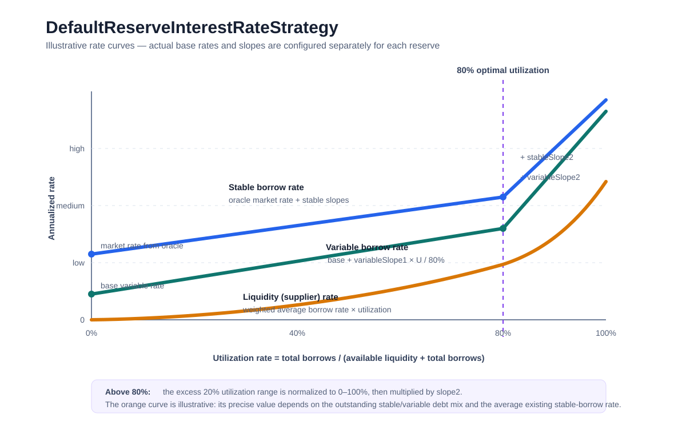

# Other Contracts

## FeeProvider

FeeProvider is the protocol-wide calculator for borrow origination fees—not a fee collector or per-reserve fee configuration.

It initializes a fixed fee of `0.0025e18`, i.e. `0.25% / 25 bps` of the borrowed amount, and returns `amount × feePercentage`.

## TokenDistributor

`TokenDistributor` is Aave’s fee-splitting vault. It holds accumulated ERC-20 tokens and native ETH, then sends configured shares to recipients when anyone triggers a distribution.

Its distribution configuration is set in the constructor and cannot be changed afterwards:

- `receivers[i]` is the address paid.
- `percentages[i]` is that recipient’s share relative to `DISTRIBUTION_BASE`.
- `DISTRIBUTION_BASE` is `10_000`, so `2_500` represents 25%.

For example, with receivers `[Treasury, Ecosystem]` and percentages `[7000, 3000]`, distributing 100 USDC pays 70 USDC and 30 USDC.

The protocol sends fees here, including flash-loan protocol fees and borrowing/origination fees; the active distributor address is held in the Addresses Provider. See [LendingPoolCore.sol](../src/lendingpool/LendingPoolCore.sol) and [LendingPoolAddressesProvider.sol](../src/configuration/LendingPoolAddressesProvider.sol).

Key functions in [TokenDistributor.sol](../src/fees/TokenDistributor.sol):

- `constructor(receivers, percentages)`: validates and stores the recipient split. The arrays must have the same length.
- `distribute(tokens)`: distributes this contract’s *entire current balance* of each listed ERC-20/ETH token.
- `distributeWithAmounts(tokens, amounts)`: distributes caller-specified amounts.
- `distributeWithPercentages(tokens, percentages)`: first takes a percentage of the current token balance (this argument uses normal `0–100` percentages), then splits that amount according to the configured basis-point distribution.
- `getDistribution()`: returns the recipient addresses and configured split.

ETH is represented in token arrays by `EthAddressLib.ethAddress()` rather than an ERC-20 address. ERC-20 payments use `SafeERC20.safeTransfer`; ETH payments use a low-level `.call`. A failed ETH payment reverts with `TokenDistributor__EthTransferFailed(receiver, amount)`.

Important details:

- Distribution functions are permissionless and protected by `nonReentrant`: anyone can cause accumulated fees to be paid out, but no public function can redirect them.
- It checks only that the receiver and percentage arrays are equally long. It does **not** require configured percentages to add up to 10,000:
  - below 10,000 leaves a remainder in the contract;
  - above 10,000 makes the transfers collectively exceed the requested amount and generally reverts once the balance is insufficient.
- Integer division truncates, so small rounding remainders remain in the contract.
- The `tokens` and value arrays supplied to `distributeWithAmounts` and `distributeWithPercentages` must have equal lengths; otherwise the call reverts with `TokenDistributor__ArrayLengthMismatch`.
- `tokenToBurn` is a legacy storage slot and is unused. This implementation has no swap-and-burn path.
- Construction emits `DistributionUpdated` twice: once inside `_setTokenDistribution`, then again explicitly. This is redundant but harmless.


## DefaultInterestRateStrategy

[`DefaultReserveInterestRateStrategy.sol`](../src/lendingpool/DefaultReserveInterestRateStrategy.sol) is Aave’s per-reserve interest-rate model. Given pool liquidity and outstanding debt, it returns:

1. The rate paid by borrowers choosing a stable rate.
2. The rate paid by variable-rate borrowers.
3. The liquidity/supply rate earned by depositors.

All rates use “ray” fixed-point units: `1e27 = 100%` (so `0.05e27` is 5%).

The key input is utilization:

$$
U = \frac{\text{total borrows}}
{\text{available liquidity} + \text{total borrows}}
$$

The curve has a kink at its 80% target utilization:

```solidity
OPTIMAL_UTILIZATION_RATE = 0.8 * 1e27
```

### Utilization at or below 80%

Rates grow gradually:

$$
R_v = R_{v0} + slope_{v1}\frac{U}{0.8}
$$

$$
R_s = R_{\text{oracle}} + slope_{s1}\frac{U}{0.8}
$$

Here, $R_v$ and $R_s$ are the current variable and stable borrow rates; $R_{v0}$ is the base variable rate, and $R_{\text{oracle}}$ is the stable-rate baseline supplied by `LendingRateOracle`. At 80%, the first slope is fully applied: the rates are $R_{v0} + slope_{v1}$ and $R_{\text{oracle}} + slope_{s1}$.

### Utilization above 80%

Rates increase much more sharply to discourage additional borrowing and attract deposits:

$$
R_v = R_{v0} + slope_{v1} + slope_{v2}\frac{U - 0.8}{0.2}
$$

$$
R_s = R_{\text{oracle}} + slope_{s1} + slope_{s2}\frac{U - 0.8}{0.2}
$$

At 100% utilization, both slope components are fully applied.



The liquidity rate is based on the weighted average cost of all outstanding debt, then scaled by utilization:

$$
R_l = U \times
\frac{B_vR_v + B_s\overline{R_s}}{B_v + B_s}
$$

Here, $R_l$ is the liquidity rate; $B_v$ and $B_s$ are the variable- and stable-rate debt totals; and $\overline{R_s}$ is the average rate locked in by existing stable borrowers. Variable debt uses the newly calculated $R_v$, whereas stable debt uses `_averageStableBorrowRate`, not the current stable borrow rate. This keeps depositor yield aligned with the interest currently accruing on the pool’s loans.

Other details:

- The stable-rate baseline comes from `LendingRateOracle.getMarketBorrowRate(_reserve)`, making it asset-specific and externally configurable.
- The stable rate is not necessarily higher than the variable rate; their relative levels depend on the oracle market rate and the configured slopes.
- The contract has no reserve factor, so in this older Aave version suppliers receive the whole modeled borrow yield; later Aave versions add a protocol reserve-factor deduction.
- `reserve` is stored in the constructor but not used by the calculation. The `_reserve` argument is what selects the oracle market rate.
- The zero-liquidity/zero-debt case explicitly sets utilization to zero, avoiding division by zero.
- [`LendingPoolCore.sol`](../src/lendingpool/LendingPoolCore.sol) invokes this strategy when reserve rates are updated after liquidity-changing actions.


## LendingPoolConfigurator

[`LendingPoolConfigurator.sol`](contracts/lendingpool/LendingPoolConfigurator.sol) is used to manage the lending pool’s reserve markets and risk settings—for example, listing an asset, setting its collateral parameters, freezing it, or changing its interest-rate strategy. It is the protocol’s **admin configuration gateway**: it does not hold reserve accounting itself, but authorizes a designated `LendingPoolManager` to update configuration stored in [`LendingPoolCore`](contracts/lendingpool/LendingPoolCore.sol).

The high-level control path is:

```text
LendingPoolManager
  → LendingPoolConfigurator
    → LendingPoolCore (stores reserve state)
```

`LendingPoolAddressesProvider` is the registry that tells the configurator where the current Core contract and manager address are. This supports upgrades without hard-coding component addresses.

### Access control

Every state-changing configuration function uses `onlyLendingPoolManager`:

```solidity
require(
  poolAddressesProvider.getLendingPoolManager() == msg.sender,
  "The caller must be a lending pool manager"
);
```

So regular users cannot list assets, change collateral parameters, freeze markets, or alter rate strategies. The configurator itself is separately authorized by Core’s `onlyLendingPoolConfigurator` modifier, creating a two-step permission boundary.


### Reserve creation

A “reserve” is a supported underlying asset market, such as DAI or WETH.

`initReserve(...)`:

1. Reads the ERC-20’s `name()` and `symbol()`.
2. Creates a new `AToken` for deposits in that reserve.
3. Calls `LendingPoolCore.initReserve(...)` to store its configuration.
4. Emits `ReserveInitialized`.

The newly deployed aToken uses names like:

```text
Aave Interest bearing DAI
aDAI
```

`initReserveWithData(...)` does the same work but accepts the name, symbol, and decimals explicitly. It exists for unusual/non-standard token contracts that do not reliably expose conventional metadata.

### Reserve removal

`removeLastAddedReserve(address)` is a constrained rollback tool. It delegates to Core, which permits removal only when:

- the target is the last reserve in the reserve list; and
- it has no outstanding borrows.

Core then clears its key configuration fields and removes it from the list. It is mainly appropriate for undoing a recent listing mistake, not removing an established live market.

### Borrow configuration

- `enableBorrowingOnReserve(reserve, stableEnabled)` enables borrowing and optionally stable-rate borrowing.
- `disableBorrowingOnReserve(reserve)` blocks new borrowing.
- `enableReserveStableBorrowRate(reserve)` / `disableReserveStableBorrowRate(reserve)` toggle only stable-rate borrowing.

Disabling borrowing does not erase existing debt; it prevents new debt in that reserve.

### Collateral and liquidation configuration

- `enableReserveAsCollateral(reserve, ltv, liquidationThreshold, liquidationBonus)` makes deposited assets usable as collateral and sets all three risk parameters.
- `disableReserveAsCollateral(reserve)` prevents future collateral use.
- `setReserveBaseLTVasCollateral`
- `setReserveLiquidationThreshold`
- `setReserveLiquidationBonus`

In this version, these are percentages on a 0–100 scale:

| Parameter | Meaning |
|---|---|
| LTV | Maximum borrowing power contributed by the collateral |
| Liquidation threshold | Point at which the position becomes liquidatable |
| Liquidation bonus | Extra collateral incentive received by a liquidator |

For example, an LTV of 75 means $100 of that collateral contributes up to roughly $75 of borrowing capacity, subject to the user’s portfolio-wide calculations.

A notable implementation detail: Core mostly assigns these values directly. The configurator does not validate relationships such as `LTV <= liquidationThreshold`; safe, coherent settings are therefore the manager/governance’s responsibility.

### Market availability controls

- `activateReserve(reserve)` marks the reserve live. Core requires the reserve’s interest indices to have been initialized first.
- `deactivateReserve(reserve)` turns it off, but this wrapper requires total liquidity to be zero first. That protects suppliers from being trapped in a disabled market.
- `freezeReserve(reserve)` is an emergency / maintenance mode:
  - blocks deposits, new borrows, and rate swaps;
  - still allows repayments, liquidations, rebalances, and redemptions.
- `unfreezeReserve(reserve)` restores normal operation.

Freezing is intentionally different from deactivation: it lets users safely unwind positions while stopping risk-increasing actions.

### Other reserve parameters

- `setReserveDecimals(reserve, decimals)` changes the unit precision Core uses for the reserve.
- `setReserveInterestRateStrategyAddress(reserve, strategy)` replaces the contract that determines utilization-based interest rates.
- `refreshLendingPoolCoreConfiguration()` asks Core to refresh cached addresses from the Addresses Provider after components have changed.
